# Artificial Neural Net Explorer — 수업 운영 가이드

> 코드 한 줄도 쓰지 않고, 슬라이더와 그림판으로 신경망의 원리를 손끝으로 배우는 14단계 인터랙티브 학습 앱을 사용한 4차시 신경망 입문 강의

---

## 목차

- [강의 개요](#강의-개요)
- [사전 준비물 · 환경 안내](#사전-준비물--환경-안내)
- [4차시 일람표](#4차시-일람표)
- [1차시 — 단일 뉴런 + 학습 원리](#1차시--단일-뉴런--학습-원리)
- [2차시 — 분류, 데이터, 평가](#2차시--분류-데이터-평가)
- [3차시 — 직접 만들고 큰 모델 체험](#3차시--직접-만들고-큰-모델-체험)
- [4차시 — 생성 모델, 마무리](#4차시--생성-모델-마무리)
- [부록 A — 통합 평가 루브릭](#부록-a--통합-평가-루브릭)
- [부록 B — 운영 팁 모음](#부록-b--운영-팁-모음)
- [부록 C — 5부·6부 화면 캡처 가이드 (히든 스테이지)](#부록-c--5부6부-화면-캡처-가이드-히든-스테이지)

---

## 강의 개요

| 항목 | 내용 |
|------|------|
| 강좌명 | 인공 신경망 입문 — 손으로 만지는 딥러닝 |
| 대상 | 고등학교 1~3학년 (정보·과학·진로 교과 통합 가능) |
| 총 시간 | **4차시 × 50분 = 200분** |
| 사전 지식 | 일차함수와 좌표평면 정도 (`y = wx + b`를 읽을 수 있으면 됨) |
| 코드 작성 | **없음.** 모든 활동은 웹앱 안에서 슬라이더·클릭·그림판으로 진행 |
| 교수 방식 | 짝 활동 권장 (옆 친구와 슬라이더 결과 비교가 토론을 자연스럽게 유발) |
| 핵심 도구 | 웹앱 — https://neural-explorer.vercel.app |
| 보조 자료 | 갤러리 저장소 — https://github.com/greatsong/neural-explorer-gallery (CC-BY 4.0) |

### 강의의 큰 그림

```
[1차시]   [2차시]   [3차시]      [4차시]
 단일      분류      직접          생성
 뉴런  →   사례  →   만들기  →    AI
                    (MNIST)
P1~5      P6~9      P10~12       P13~14
```

학생은 4차시를 거치며 다음을 직접 손으로 체험합니다:

1. **뉴런 하나가 어떻게 작동하는가** (가중치·편향·활성화 함수)
2. **신경망이 어떻게 스스로 배우는가** (오차→기울기→수정의 반복)
3. **AI 모델 평가의 함정** ("정확도 99%"가 함정인 이유)
4. **데이터의 양이 모델 품질을 어떻게 바꾸는가**
5. **문제 복잡도와 신경망 크기의 관계** (ChatGPT가 왜 거대한지)
6. **분류와 생성이 같은 원리에서 나온다는 통찰**

### 학습 성과 목표

수업이 끝났을 때 학생은:

- 신경망의 핵심 개념(가중치, 편향, 활성화, 손실, 경사 하강법)을 자기 언어로 설명할 수 있다.
- 정확도·정밀도·재현율의 차이를 의료 검진 사례로 설명할 수 있다.
- 데이터·모델 크기·문제 복잡도의 관계를 직관적으로 안다.
- 생성 AI(ChatGPT, Stable Diffusion)가 어떤 원리로 동작하는지 큰 그림을 안다.
- AI를 신비한 마법이 아니라 **이해하고 만들 수 있는 도구**로 인식한다.

---

## 사전 준비물 · 환경 안내

### 학생 1인당

- 노트북 또는 데스크톱 컴퓨터 1대 (스마트폰 가능하지만 8×8 그리기는 PC 권장)
- 인터넷 연결
- 최신 Chrome/Edge/Safari 브라우저
- 필기구 (활동지 사용 시)

### 교실 환경

- 빔프로젝터 또는 대형 디스플레이 (교사 시연용)
- 와이파이 (공유기 1대당 30명 정도 무리 없음)
- 책상 배치는 짝 활동(2인 1조)에 맞게 권장

### 사전 점검 (수업 전날)

```
□ neural-explorer.vercel.app 접속 확인
□ 1차시 페이즈 1~5 한 번 실행해보기
□ 페이즈 11~12의 MNIST 데이터 로딩 (~50KB) 확인
□ 학생 와이파이 대역폭 확인 (페이즈 11에서 약 50KB/명 다운로드)
□ 갤러리 공유 기능 활성화 여부 확인
   (Vercel 환경변수 GITHUB_TOKEN 설정 필요 — 페이즈 10용)
```

### 첫 수업 시 학생 안내

```
선생님: "오늘부터 4차시 동안 인공지능이 어떻게 학습하는지를
         여러분이 직접 슬라이더로 만져보면서 배울 거예요.
         코드는 한 줄도 안 써요. 그림 그리고 슬라이더만 움직이면 돼요.
         자, 노트북 켜고 이 주소 들어가세요 → neural-explorer.vercel.app"

(주소를 칠판이나 슬라이드에 띄워두면 좋음)
```

---

## 4차시 일람표

| 차시 | 주제 | 사용 페이즈 | 핵심 활동 | 학생 산출물 |
|------|------|------------|----------|------------|
| **1차시** | 단일 뉴런 + 학습 원리 | P1~5 | 가중치 슬라이더, 순전파 퀴즈 3문제, 손실 포물선, 수동 학습, 경사 하강법 | 페이즈 5에서 손실 0.05 이하 달성 스크린샷 |
| **2차시** | 분류, 데이터, 평가 | P6~9 | 입시 합격 예측 (정시/학종), 데이터 추가 효과, 혼동 행렬, 코로나·암 시나리오 | 시험 정확도 85% 이상 달성 + 정밀도/재현율 트레이드오프 표 |
| **3차시** | 직접 만들고 큰 모델 체험 | P10~12 | 8×8 도트 그림 학습 + 갤러리 공유, 신경망 크기 3단계, MNIST 직접 그린 숫자 테스트 | 갤러리 공유 1건 + MNIST 시험 정확도 70%+ |
| **4차시** | 생성 모델, 마무리 | P13~14 | 평균 이미지, 오토인코더 잠재 공간 탐험, 마무리 토론 | 잠재 공간에서 새 그림 생성 스크린샷 + 한 줄 소감 |

### 시간 배분 표준 패턴 (각 차시 공통)

```
[00-05분] 도입       — 지난 차시 회고 + 오늘 목표
[05-40분] 핵심 활동  — 페이즈별 실습 (짝 토론 포함)
[40-50분] 정리       — 오늘의 발견 공유 + 다음 차시 예고
```

---

## 1차시 — 단일 뉴런 + 학습 원리

### 기본 정보

| 항목 | 내용 |
|------|------|
| 주제 | 인공 뉴런 하나가 어떻게 작동하고, 어떻게 스스로 학습하는가 |
| 시간 | 50분 |
| 형태 | 짝 활동 (2인 1조) |
| 사용 페이즈 | P1 인공 뉴런 해부 / P2 순전파 퀴즈 / P3 오차 측정 / P4 수동 학습 / P5 기울기와 수정 |
| 준비물 | 노트북, 활동지 (선택) |

### 학습 목표

이 차시가 끝나면 학생은:

1. 인공 뉴런이 입력에 가중치를 곱하고, 편향을 더한 후, 활성화 함수를 통과시킨다는 것을 설명할 수 있다.
2. 손실(loss)이 무엇이고 왜 작아져야 하는지를 자기 언어로 설명할 수 있다.
3. 슬라이더로 가중치·편향을 조정해서 데이터에 맞는 직선을 직접 찾을 수 있다.
4. 경사 하강법이 "기울기 반대 방향으로 한 걸음씩"이라는 것을 시각화로 이해한다.
5. 컴퓨터의 자동 학습이 사람이 손으로 한 일을 빠르게 반복하는 것임을 깨닫는다.

### 50분 타임라인

```
[00-05] 도입            ───── 빔프로젝터로 인트로 페이지 띄우기
[05-12] P1 인공 뉴런 해부  ── 슬라이더 만지며 구조 익히기
[12-22] P2 순전파 퀴즈    ── 직접 계산 3문제
[22-30] P3 오차 측정      ── 손실 포물선 + 슬라이더
[30-40] P4 수동 학습      ── 직선 데이터에 W, b 맞추기
[40-47] P5 기울기와 수정  ── 자동 학습으로 같은 문제 풀이
[47-50] 정리            ── 오늘 발견한 것 짝 발표
```

### 상세 수업 진행

#### 도입 (00-05분)

**[강의 스크립트]**

선생님: "오늘부터 4차시 동안 인공지능이 어떻게 학습하는지 직접 만져볼 거예요. AI라고 하면 뭔가 마법 같죠? 오늘 끝나면 '아, 이거 별거 아니네'라고 생각할 거예요. 좋은 의미로요. 신경망이라고 부르는 게, 사실은 곱셈과 덧셈을 잘 조합한 거거든요."

선생님: "주소 띄울게요. **neural-explorer.vercel.app**. 들어가면 '처음부터 시작하기' 버튼 보이죠? 누르세요."

**[수업 장면]**
민지가 친구 옆을 보며: "이거 코드 안 써도 되지?"
영수: "응 슬라이더만 움직이면 된대"
민지: "오 신기"

#### P1 인공 뉴런 해부 (05-12분)

**[학생 활동 안내]**

1. 페이즈 1 페이지로 이동 (사이드바에서 "1. 인공 뉴런 해부")
2. **1-1 가중치** 탭에서 슬라이더 w₁, w₂를 움직여본다 → 출력 y가 어떻게 바뀌나?
3. **1-2 편향** 탭으로 → b 슬라이더를 추가로 만져본다
4. **1-3 활성화 함수** 탭으로 → ReLU의 효과 (음수면 0이 되는 것) 관찰

**[강의 스크립트]**

선생님: "여러분이 보고 있는 게 인공 뉴런 하나예요. 입력 두 개, 출력 하나. **w₁=2, w₂=3, x₁=4, x₂=2**일 때 y가 얼마인지 옆사람과 계산해보세요. 30초 줄게요."

(잠시 후) "맞아요, 14예요. 그럼 활성화 함수 ReLU는 왜 있을까요? 슬라이더로 음수가 되게 만들어보세요. 출력이 0이 되죠? 'ReLU = 음수면 0, 양수면 그대로'예요. 단순하지만 이거 없으면 신경망이 직선밖에 못 배워요."

**[시각 자료 — SVG 다이어그램 안내]**

```
   x₁ ──[w₁]─┐
              ├─→ Σ ──→ ReLU ──→ y
   x₂ ──[w₂]─┤
              b
```

**[예상 Q&A]**

Q: "가중치(weight)와 편향(bias)의 차이가 뭐예요?"
A: "가중치는 '입력의 영향력'이에요. w₁이 크면 x₁의 영향이 커요. 편향은 '기본값'이에요. 입력이 0이어도 출력이 0이 아닐 수 있게 해주는 보정값."

Q: "ReLU 말고 다른 활성화 함수도 있나요?"
A: "네, 시그모이드(0~1로 누름), tanh(-1~1로 누름) 등 많아요. 페이즈 9에서 시그모이드를 만나게 될 거예요. ReLU는 가장 빠르고 단순해서 요즘 가장 많이 써요."

#### P2 순전파 퀴즈 (12-22분)

**[학생 활동]**

세 문제를 직접 계산해서 답을 입력. 틀리면 힌트 펼침으로 단계별 풀이 확인.

**[강의 스크립트]**

선생님: "이제 직접 계산해볼 시간. 페이즈 2로 가세요. 종이에 풀어도 되고 머리로 해도 돼요. 답을 입력하면 바로 알려줘요. 다 맞히면 손 들어요."

(7~8분 후)

선생님: "다 맞춘 친구들 박수! 못 맞춘 친구는 힌트 보세요. 1단계 곱셈, 2단계 덧셈, 3단계 ReLU 순서대로 풀이 펼쳐줘요."

**[수업 장면 — 막혔다가 해결]**

수연: (계산 결과 -3을 입력) "어? 틀렸대"
민수 (옆에서): "그거 ReLU 안 했지? 음수면 0이야."
수연: "아!" (0 입력 후 정답)
선생님: (지나가며) "그게 ReLU예요. 음수는 다 0으로 눌러요."

**[예상 Q&A]**

Q: "가중치가 음수면 어떤 의미예요?"
A: "그 입력이 출력을 **줄이는** 방향으로 작용한다는 뜻이에요. 예를 들어 합격 예측에서 '결석 일수' 같은 건 음수 가중치가 자연스럽죠."

#### P3 오차 측정 (22-30분)

**[학생 활동]**

정답이 5인 상황에서 슬라이더로 예측값을 움직여본다. 손실 포물선 위 점이 따라 움직이며, 손실이 0에 가까워지면 페이즈 통과.

**[강의 스크립트]**

선생님: "지금까지는 뉴런이 정해진 가중치로 계산만 했어요. 이제 '얼마나 틀렸는지' 알아봐야 학습이 가능하잖아요. 페이즈 3 가세요."

선생님: "정답은 5예요. 슬라이더로 예측값을 움직이면서, **손실(loss)** 이라는 게 어떻게 변하는지 관찰해보세요. 손실 = (예측 − 정답)². 왜 제곱일까요?"

(잠시 후)

선생님: "음수든 양수든 똑같이 처벌하기 위해서예요. 위로 1만큼 틀린 거나 아래로 1만큼 틀린 거나, 손실은 둘 다 1이어야 공평하잖아요. 제곱은 그걸 만들어줘요."

**[예상 Q&A]**

Q: "왜 그냥 절댓값 안 쓰고 제곱을 써요?"
A: "절댓값도 가능해요. 다만 제곱은 미분(나중에 페이즈 5에서 만남)이 더 부드러워서 학습이 잘 돼요. 머신러닝에서 자주 쓰는 이유예요."

Q: "손실이 0이면 완벽한 모델인가요?"
A: "학습 데이터에 대해서만 그래요. 새 데이터에선 어떨지는 모르고요. 페이즈 7에서 그 함정을 만날 거예요."

#### P4 수동 학습 (30-40분)

**[학생 활동]**

`y = 2x + 1` 직선 위의 점 5개에 W와 b를 손으로 맞춰서 총 손실 ≤ 1 만들기.

**[강의 스크립트]**

선생님: "이제 페이즈 4. 점 5개가 보이죠? 직선이 이 점들을 잘 따라가도록 W, b를 맞춰보세요. 총 오차가 1보다 작아지면 통과예요. 옆사람이랑 누가 먼저 맞추는지 게임."

(5분 후)

선생님: "다 맞춘 친구는 손 들어보세요. (학생들 손) 정답이 W=2, b=1이에요. 비슷하게 나왔죠? 여러분이 방금 한 게 **학습**이에요. 슬라이더로 손실을 줄였잖아요. 이게 ML이 하는 일의 본질이에요."

**[수업 장면 — 깨달음]**

영수: "어? W를 2로 맞추니까 그냥 직선이 점 위에 딱 올라갔어요."
선생님: "맞아요. 데이터가 만들어진 진짜 공식을 여러분이 찾아낸 거예요. 컴퓨터가 자동으로 하는 게 다음 페이즈."

**[예상 Q&A]**

Q: "총 오차 0이 안 되네요?"
A: "데이터에 약간 노이즈가 있을 수도 있고, 슬라이더 정밀도 한계도 있어요. 1 이하면 충분해요."

Q: "데이터가 직선이 아니면 어떻게 해요?"
A: "단일 뉴런으로는 직선밖에 못 그려요. 곡선이나 복잡한 패턴은 뉴런을 여러 개 묶어야 해요. 페이즈 11에서 만남."

#### P5 기울기와 수정 (40-47분)

**[학생 활동]**

같은 문제를 컴퓨터가 자동으로 푸는 과정을 관찰. "1번 갱신" 버튼을 천천히 누르며 기울기 화살표가 어떻게 움직이는지 본다. 이후 "20번 반복" / "100번 반복" 으로 자동 수렴 확인.

**[강의 스크립트]**

선생님: "여러분이 손으로 했던 일을 컴퓨터는 어떻게 자동으로 할까요? 핵심은 **기울기**예요. 페이즈 5 가세요."

선생님: "①오차, ②기울기 계산, ③수정 — 세 단계가 한 번에 보이죠? '한 번 실행' 버튼을 천천히 눌러보세요. 기울기 화살표가 손실이 작아지는 방향을 가리켜요. 컴퓨터는 그 방향으로 한 걸음씩 가요. 학습률이 한 걸음의 크기."

**[수업 장면 — 발견]**

민지: "와 자동으로 정답에 도착하네요!"
선생님: "그게 **경사 하강법(Gradient Descent)**이에요. ChatGPT도 이 방법으로 배워요. 규모만 어마어마할 뿐."

**[예상 Q&A]**

Q: "학습률을 너무 크게 하면 어떻게 돼요?"
A: "직접 해보세요. 슬라이더 끝까지 올리고 100번 갱신 누르면 발산해요. 너무 큰 보폭으로 걸으면 정답을 지나쳐서 점점 멀어지는 거예요."

Q: "그럼 학습률은 몇이 좋아요?"
A: "데이터마다 다르지만, 보통 0.01~0.1 사이를 시작점으로 써요. 너무 작으면 느리고 너무 크면 발산. 균형 잡기가 ML 엔지니어의 중요한 일이에요."

#### 정리 (47-50분)

**[강의 스크립트]**

선생님: "오늘 배운 것 짝과 30초 동안 정리해보세요. 키워드는 가중치, 편향, 활성화, 손실, 기울기."

(잠시 후) "한 명만 발표해볼까요?"

학생: "뉴런은 입력에 가중치 곱해서 더한 다음 활성화 함수 통과시키고, 손실이 작아지는 방향으로 가중치를 조금씩 바꾸는…"

선생님: "완벽! 다음 시간엔 이걸 진짜 문제에 적용할 거예요. 입시 합격 예측."

### 평가 체크리스트 (1차시)

| 학생 본인이 확인 | 통과 기준 |
|----------------|----------|
| □ P1에서 슬라이더 움직일 때 출력이 어떻게 변하는지 봤다 | 직접 만져봄 |
| □ P2 퀴즈 3문제를 모두 정답 처리 받았다 | 100% |
| □ P3에서 손실을 0.3 이하로 만들었다 | 페이즈 자동 통과 |
| □ P4에서 총 오차 1 이하 달성 | 페이즈 자동 통과 |
| □ P5에서 손실 0.05 이하 달성 | 페이즈 자동 통과 |

### 오개념 주의 포인트

- **"가중치 = 정답"이라는 오해** → 가중치는 데이터에 맞는 적절한 값. 정답이 따로 있는 게 아님.
- **"학습 = 외우기"라는 오해** → 외우는 게 아니라 패턴을 찾는 것. 페이즈 7에서 일반화 개념으로 보강.
- **"오차 = 빼기"라는 오해** → 오차의 크기가 중요. 그래서 제곱 또는 절댓값으로 다룸.
- **"기울기 = 직선의 기울기"라는 혼동** → 여기서 기울기는 손실의 미분(변화율). 다차원 평면에서 가장 가파른 방향.

### 확장 활동 (빠른 학생용)

- P5 학습률 슬라이더를 0.001부터 0.2까지 다양하게 바꿔가며 수렴 속도 비교 → "왜 너무 작으면 안 되는지" 직접 보기
- P5 초기화 버튼 여러 번 눌러서, 시작 위치가 달라도 결국 같은 정답에 도달하는지 확인
- P1 활성화 함수 1-3 탭에서 ReLU 효과를 끄고 켜며 출력 차이 비교

### 보충 활동 (어려워하는 학생용)

- P2 퀴즈에서 "힌트 보기"를 적극적으로 사용하도록 안내. 단계별 풀이를 따라 손으로 종이에 적게 함
- P3 슬라이더를 정답값 5에 정확히 두고 손실이 0이 되는지 확인 → 손실의 의미 체감
- P4를 W=0, b=0에서 시작해 한 번에 한 슬라이더만 움직여서 총 오차 변화 관찰

---

## 2차시 — 분류, 데이터, 평가

### 기본 정보

| 항목 | 내용 |
|------|------|
| 주제 | 신경망으로 합격/불합격을 분류하기, 데이터의 양이 모델 품질에 미치는 영향, "정확도"의 함정 |
| 시간 | 50분 |
| 형태 | 짝 활동 + 부분 토론 |
| 사용 페이즈 | P6 입시 합격 예측 / P7 데이터 추가 후 재학습 / P8 정확도 / P9 평가의 함정 |
| 준비물 | 노트북, 활동지 (정밀도/재현율 비교표 칸) |

### 학습 목표

1. 단일 뉴런으로 다차원 입력의 합격/불합격을 분류할 수 있음을 이해한다.
2. 데이터가 많을수록 모델의 일반화 성능이 좋아진다는 것을 직접 관찰한다.
3. 혼동 행렬(TP, FP, TN, FN)을 읽고 그릴 수 있다.
4. "정확도가 높다"고 다 좋은 모델이 아니라는 것을 의료 검진 사례로 설명할 수 있다.
5. 정밀도와 재현율의 트레이드오프를 임계값 슬라이더로 직접 체험한다.

### 50분 타임라인

```
[00-05] 도입 + 1차시 회고
[05-22] P6 입시 합격 예측 (시나리오 선택, 10명, 3탭)
[22-30] P7 데이터 추가 후 재학습 (10→40명 비교)
[30-37] P8 정확도 (혼동 행렬)
[37-47] P9 평가의 함정 (코로나/암 시나리오)
[47-50] 정리 + 짝 토론
```

### 상세 수업 진행

#### 도입 (00-05분)

**[강의 스크립트]**

선생님: "지난 시간에 우리는 뉴런 하나가 어떻게 학습하는지 봤어요. 오늘은 이걸 진짜 문제에 적용할 거예요. **입시 합격 예측**. 어떤 대학이 가중치를 공개 안 했을 때, 합격자/불합격자 명단만 보고 그 가중치를 거꾸로 추정할 수 있을까?"

선생님: "이건 그냥 게임 같지만, 사실은 머신러닝의 본질이에요. 데이터로부터 숨겨진 규칙을 찾는 일."

#### P6 입시 합격 예측 (05-22분)

**[학생 활동 — 시나리오 선택]**

학생은 정시(수능 위주) 또는 학종(서류 위주) 중 하나를 선택. 둘 다 같은 구조지만 변수 이름이 다름.

**[학생 활동 — 3탭 진행]**

1. **① 상황과 데이터** 탭: 학생 10명의 점수와 합격 여부 표를 관찰. 슬라이더 없음. "어떤 항목이 영향이 클까?" 가설 세우기 (1~2분).
2. **② 가중치 조정** 탭: 슬라이더로 가중치 4개 + 합격컷 조정. 학생 카드 색이 실시간 변화. 8/10 이상 맞히기.
3. **③ 시험 데이터로 평가** 탭: 학습에 안 쓰인 새 학생 20명에 적용 → 시험 정확도 확인.

**[강의 스크립트 — 탭 1]**

선생님: "페이즈 6 가세요. 정시랑 학종 중 골라요. 처음 나오는 화면에서 슬라이더 만지지 말고, 먼저 데이터를 5분 관찰하세요. 합격자들이 어떤 점수가 높은지, 패턴이 보이나요?"

**[수업 장면 — 가설 세우기]**

영수: "어, 합격자는 다 국어 수학이 8점 넘던데?"
민지: "근데 영어는 합격자랑 불합격자랑 비슷한데?"
선생님: (지나가며) "좋은 관찰이에요. 그러면 영어 가중치는 클까 작을까?"
영수: "작을 것 같아요!"

**[강의 스크립트 — 탭 2]**

선생님: "이제 ② 탭으로 가서 가중치 슬라이더 움직이세요. 학생 카드가 실시간으로 색깔 바뀝니다. 8/10 이상 맞히면 페이즈 통과. 한 가지 힌트 — 모든 항목을 똑같이 0.25로 두면 잘 안 풀려요. 어떤 항목이 더 중요한지 데이터에서 단서를 찾아야 돼요."

**[강의 스크립트 — 탭 3]**

선생님: "③ 탭. 학습 데이터 10명에선 8/10이었는데, 새 학생 20명에 적용하면 어때요?"

(학생들 확인) "정확도가 떨어지는 사람 있죠? 이게 **일반화 부족** 문제예요. 학습 데이터에서만 잘 맞춘 거예요."

**[예상 Q&A]**

Q: "학습 데이터 정확도가 100%인데 시험 데이터 정확도는 70%예요. 왜?"
A: "10명만 보고 가중치를 찾아서, 그 10명에 우연히 잘 맞는 가중치를 골랐을 뿐이에요. 진짜 패턴은 더 많은 데이터로만 보여요. 다음 페이즈에서 해결책 봅시다."

Q: "진짜 입시는 이것보다 복잡하잖아요?"
A: "맞아요, 자기소개서, 면접 등 정성적 요소가 많죠. 그런데 머신러닝은 정량적인 수치만 다룰 수 있어서, 입시 평가에서 모델의 한계가 분명해요. 좋은 토론거리예요."

#### P7 데이터 추가 후 재학습 (22-30분)

**[학생 활동]**

페이즈 6에서 찾은 가중치를 그대로 들고 옴. 데이터를 40명으로 확장한 뒤 다시 슬라이더 미세 조정. 비교표가 자동으로 채워지며 시험 정확도가 얼마나 올라가는지 관찰.

**[강의 스크립트]**

선생님: "30명 새 데이터를 더 모았어요. 페이즈 7로 가세요. 같은 슬라이더로 다시 조정해보세요. 시험 정확도가 어떻게 변해요?"

(학생들 작업) "85% 넘는 친구 손?"

**[수업 장면 — 데이터의 힘]**

수연: "어 진짜 시험 정확도가 65에서 90으로 올라갔어요"
선생님: "축하해요. 같은 사람(여러분)이 같은 슬라이더로 했는데, 데이터가 4배 늘어나니 모델이 더 정확해진 거예요. **머신러닝이 데이터를 갈구하는 이유**예요."

**[가상 인물 합불 예측 — SNS 통지서]**

선생님: "③ 탭에서 가상 인물에 점수 넣어보세요. 자기 점수를 넣어도 돼요. SNS 카드 형식으로 결과가 나와요. 합격? 예비? 불합격?"

(학생들 즐거워함)

선생님: "재밌긴 한데, 카드 아래 작은 글씨 봐요. '이 모델은 점수만 보고 판단합니다.' AI는 강력하지만 만능이 아니에요."

#### P8 정확도 (30-37분)

**[학생 활동]**

페이즈 7 모델 결과로 혼동 행렬을 직접 본다. TP/FP/TN/FN 각 칸의 의미를 짝과 함께 짚어가며 정확도 공식을 확인.

**[강의 스크립트]**

선생님: "정확도가 90% 좋은 거예요. 그런데 90%가 어떤 90%인지 봐야 돼요. 페이즈 8에서 **혼동 행렬**을 그려봅시다."

선생님: "TP는 진짜 합격을 합격이라고 한 것, FP는 불합격인데 합격이라고 한 것… 짝이랑 한 번씩 짚어보면서 외워봐요. 30초."

**[예상 Q&A]**

Q: "TP, FP, TN, FN 외우기 어려워요."
A: "P/N은 모델의 예측, T/F는 그 예측이 맞았는지를 의미해요. 'True Positive = 양성으로 맞춤'. 영어로 외우면 의미가 또렷해요."

#### P9 평가의 함정 (37-47분)

**[학생 활동]**

코로나 또는 암 시나리오 선택. 1000명 중 양성률이 매우 낮은 상황(2% 또는 0.5%)에서, "전원 음성" 모델조차 정확도 98%~99%인 함정을 직접 본다. 임계값 슬라이더로 정밀도/재현율 트레이드오프 체험.

**[강의 스크립트]**

선생님: "충격적인 데이터 보여줄게요. 페이즈 9 가세요. 코로나 진단 시나리오. 1000명 중 진짜 양성은 20명. 만약 모델이 **'무조건 음성'** 이라고만 출력해도 정확도 몇 퍼센트일까요?"

학생: "음… 980/1000?"
선생님: "맞아요. 98%. 정확도 99% 모델이 사실은 환자를 한 명도 못 잡는 모델일 수 있어요. **정확도만 보면 안 되는 이유**예요."

**[강의 스크립트 — 정밀도/재현율]**

선생님: "그래서 두 가지 지표가 더 필요해요."
- **정밀도(Precision)**: 양성이라고 한 것 중 진짜 양성 비율 → 양치기 소년 모델인지 체크
- **재현율(Recall)**: 진짜 양성 중 우리가 잡은 비율 → 환자를 놓치는 모델인지 체크

선생님: "임계값 슬라이더 움직여보세요. 둘이 시소처럼 움직이는 게 보이죠?"

**[수업 장면 — 깨달음]**

민지: "임계값 낮추면 환자는 다 잡는데, 멀쩡한 사람도 양성이라고 해요"
선생님: "그게 **트레이드오프**예요. 암은 놓치면 큰일이니까 재현율을 높이고, 코로나는 격리 부담도 있으니까 균형이 중요해요. **상황에 따라 좋은 모델이 달라요.**"

**[예상 Q&A]**

Q: "그럼 정확도는 쓸모없는 지표예요?"
A: "그건 아니에요. 데이터가 균형잡혀 있을 때(예: 합격/불합격 비율이 비슷)는 정확도가 좋은 지표예요. 클래스 불균형이 심한 경우에만 함정에 빠지는 거예요."

Q: "F1 score가 뭐예요?"
A: "정밀도와 재현율을 합친 한 숫자예요. 둘의 조화 평균. 한 숫자로 보고 싶을 때 써요. 학생이 더 알고 싶으면 검색해봐요."

Q: "코로나는 정밀도 vs 재현율 어느 쪽이 더 중요해요?"
A: "그건 사회적 합의에 달렸어요. 의료진은 보통 재현율(놓치지 않음)을 우선시하지만, 격리 비용이 너무 크면 균형을 봐요. AI 윤리의 영역이에요."

#### 정리 (47-50분)

**[강의 스크립트]**

선생님: "오늘 배운 거 한 줄로 짝에게 말해보세요. 키워드는 일반화, 데이터, 정밀도, 재현율."

선생님: "다음 시간엔 여러분이 직접 그림을 그리고, 그 그림으로 신경망을 학습시킬 거예요. 그리고 진짜 손글씨도 인식시켜 볼 거예요."

### 평가 체크리스트 (2차시)

| 학생 본인이 확인 | 통과 기준 |
|----------------|----------|
| □ P6에서 시나리오 선택 후 학습 정확도 80% 이상 | 8/10 이상 |
| □ P7에서 시험 정확도 85% 이상 (40명 학습 후) | 17/20 이상 |
| □ P8에서 TP/FP/TN/FN 4칸 의미를 말로 설명할 수 있다 | 짝 점검 |
| □ P9 임계값 슬라이더로 정밀도/재현율 시소를 봤다 | 직접 만져봄 |
| □ "정확도 99%인데 환자를 놓치는 모델"의 예시를 설명할 수 있다 | 토론 발화 |

### 오개념 주의 포인트

- **"학습 정확도가 곧 좋은 모델"이라는 오해** → 시험 데이터(unseen)가 진짜 평가 기준
- **"데이터가 많을수록 무조건 좋다"의 단순화** → 데이터의 질도 중요. 다음 페이즈 P11~12에서 구분 어려운 클래스로 보강
- **"정밀도와 재현율은 같이 올릴 수 있다"의 오해** → 임계값 한 개로는 시소 관계. 모델 자체를 좋게 만들어야 둘 다 오름
- **"음성 = 음성이라고 출력"의 단순화** → P9에서 "전원 음성" 모델의 정확도 98% 함정으로 깨기

### 확장 활동 (빠른 학생용)

- P6에서 정시·학종 둘 다 풀어보기. 어느 쪽이 가중치 추적이 더 쉬웠는지 비교
- P7 가상 인물 예측에서 자기 점수 넣어보고, 가중치 슬라이더를 조금씩 바꿔서 합격→불합격으로 결과가 뒤집히는 임계 지점 찾기
- P9에서 코로나·암 둘 다 풀고, 각각 어느 임계값이 좋을지 토론

### 보충 활동 (어려워하는 학생용)

- P6에서 데이터 표를 종이에 옮겨 적고, "내신 1등급 = 합격? 5등급 = 합격?" 같은 단순한 패턴부터 찾기
- P8 혼동 행렬을 빈 4칸 표로 종이에 그려보고, 각 칸에 어떤 학생이 들어가는지 손으로 분류
- P9 "전원 음성" 모델의 정확도가 왜 98%인지 짝과 함께 계산: (980 정상 + 0 환자) / 1000

---

## 3차시 — 직접 만들고 큰 모델 체험

### 기본 정보

| 항목 | 내용 |
|------|------|
| 주제 | 직접 그린 그림으로 학습시키기, 진짜 MNIST로 신경망 크기와 문제 복잡도의 관계 발견 |
| 시간 | 50분 |
| 형태 | 짝 활동 (그림은 개인, 학습 결과는 짝과 비교) |
| 사용 페이즈 | P10 도트 그림 학습 / P11 신경망 설계 / P12 MNIST 도전 |
| 준비물 | 노트북, (선택) 갤러리 공유용 닉네임 미리 정해두기 |

### 학습 목표

1. 8×8 도트 캔버스에 직접 그린 그림으로 단일 뉴런이 학습하는 과정을 본다.
2. 자신이 만든 데이터를 오픈 데이터셋(CC-BY 4.0)에 기여하는 경험을 한다.
3. 분류 문제의 복잡도(2종 → 10종)와 신경망 크기의 관계를 직접 파라미터 수로 비교한다.
4. 진짜 MNIST 데이터로 분류 모델을 학습시키고, 자신이 그린 숫자를 인식시켜본다.
5. 우리가 만든 모델과 GPT-4·뇌 시냅스의 규모 차이를 숫자로 체감한다.

### 50분 타임라인

```
[00-03] 도입
[03-22] P10 도트 그림 학습 (4탭: 그리기 → 학습 → 테스트 → 공유)
[22-37] P11 신경망 설계 3단계 (2종 → 3종 → 10종)
[37-47] P12 MNIST 도전 + 직접 그린 숫자 테스트
[47-50] 정리 + 규모 비교 임팩트
```

### 상세 수업 진행

#### 도입 (00-03분)

**[강의 스크립트]**

선생님: "지난 시간엔 누가 만든 데이터를 가지고 분류했어요. 오늘은 여러분이 **직접 그린 그림**으로 학습시킬 거예요. 그리고 그 그림은 인터넷에 공개돼요. 다음 학기 후배들이 여러분 그림으로 공부할 수 있어요. **MNIST의 미니 버전을 우리 학교가 만드는 거예요.**"

#### P10 도트 그림 학습 (03-22분)

**[학생 활동 — 4탭]**

1. **① 그림 모으기**: 카테고리 짝(예: 네모/동그라미) 선택. 프리셋 24장 불러오기 + 자기 그림 추가
2. **② 학습**: 단일 뉴런 + 시그모이드 학습 (80 에폭, 자동)
3. **③ 테스트**: 새 그림 그려서 분류 결과 확인
4. **④ 갤러리 공유** (선택): 닉네임 + CC-BY 동의 후 GitHub repo에 자동 커밋

**[강의 스크립트 — 그리기]**

선생님: "페이즈 10 가세요. 카테고리 3쌍 중 골라요. 네모/동그라미 추천. **'프리셋 24장 불러오기'** 버튼 눌러서 미리 준비된 데이터 받으세요. 거기다 본인 그림 2~3장 추가해보세요. 마우스로 드래그하면 그릴 수 있어요."

**[강의 스크립트 — 학습]**

선생님: "② 학습 탭으로. '학습 시작' 누르면 80 에폭 자동 학습. 1초 정도 걸려요. 손실 곡선 봐요. 정확도 100% 나오는 사람?"

**[학습된 가중치 시각화]**

선생님: "스크롤 내려서 **'학습된 가중치 시각화'** 보세요. 파란색 픽셀과 주황색 픽셀이 보이죠? 파란 = 첫 라벨로 분류시키는 자리, 주황 = 두 번째 라벨로 분류시키는 자리. **신경망이 어떤 픽셀에 주목했는지 볼 수 있어요.**"

**[수업 장면 — 와우 모먼트]**

민지: "와 가중치 보니까 진짜 네모랑 동그라미 차이 나는 자리에 색깔이 진해요"
선생님: "맞아요. 신경망이 스스로 발견한 거예요. 우리는 라벨만 줬지, '여기 봐'라고 안 알려줬는데."

**[강의 스크립트 — 테스트]**

선생님: "③ 테스트 탭. 새 그림 그려보세요. 모델이 뭐라고 하는지 봐요. **정해진 카테고리에 없는 그림(예: 삼각형)을 그리면** 어떻게 될까요?"

(학생들 시도) "확신도가 50% 근처로 떨어지죠? 모델이 '잘 모르겠다'고 표현하는 거예요."

**[강의 스크립트 — 갤러리 공유]**

선생님: "④ 갤러리 공유 탭. 본인 그림을 공개 데이터셋에 기여하고 싶은 사람만. **CC-BY 4.0** 라이선스, 14세 이상, 동의 체크. 닉네임은 선택. 제출하면 GitHub에 자동으로 커밋돼요. 다음 학기 후배가 여러분 그림으로 공부할 수 있어요. **여러분이 인공지능 시대의 데이터 기여자가 되는 거예요.**"

**[수업 장면 — 갤러리 공유]**

(학생 5명이 공유 클릭) 화면에 "🎉 12장 제출 완료!" 메시지 뜸
영수: "오 이제 진짜 인터넷에 있는 거예요?"
선생님: "네 진짜로요. github.com/greatsong/neural-explorer-gallery 가서 확인해도 돼요. 나중에 인공지능 데이터셋 검색 결과에 여러분 이름이 뜰 수도 있어요."

**[예상 Q&A]**

Q: "왜 단일 뉴런으로 그림이 분류돼요? 너무 단순한 거 아니에요?"
A: "8×8 = 64픽셀 입력에 가중치 64개 + 편향 1개 = 65개 파라미터로 두 모양을 구분하는 거예요. 신기하죠. 하지만 한계가 있어요. 페이즈 11에서 더 큰 신경망 만나요."

Q: "프리셋이랑 직접 그린 거랑 섞으면 뭐가 좋아요?"
A: "다양성이 늘어나요. 학생마다 그림 스타일이 다르니까, 모델이 더 강건해져요(robust)."

Q: "삭제 토큰이 뭐예요?"
A: "공유 후 발급되는 비밀 코드예요. 나중에 후회해서 지우고 싶으면 그 코드로 삭제할 수 있어요. 잃어버리지 마세요."

#### P11 신경망 설계 (22-37분)

**[학생 활동]**

3단계 난이도를 차례로 도전:
- **단계 A**: 0과 1 분류 (2종, 쉬움)
- **단계 B**: 0, 1, 7 분류 (3종, 중간)
- **단계 C**: 0~9 모두 분류 (10종, 어려움)

각 단계마다 은닉 뉴런 수를 직접 조절하고 학습 → 비교표가 자동으로 채워짐.

**[강의 스크립트]**

선생님: "페이즈 11. 진짜 MNIST 데이터로 가요. 단계 A부터. **0과 1 두 숫자만 구분**. 은닉 뉴런 4개로 학습해보세요. 정확도 몇 퍼센트?"

학생: "98%요!"
선생님: "그렇죠. 쉬운 문제. 이제 단계 B. **0, 1, 7 세 숫자**. 은닉 뉴런 4개로 다시 해보세요. 어때요?"

학생: "85%로 떨어졌어요"
선생님: "더 어려운 문제니까 같은 크기 모델로는 부족해요. 은닉 뉴런 8개로 늘려보세요."

학생: "아 95%!"
선생님: "좋아요. **단계 C — 0~9 전부**. 4개로는 어떨까요? 8개로는?"

(학생들 실험) "은닉 뉴런 16, 32 늘리면서 시험 정확도 어떻게 바뀌나 관찰해보세요."

**[파라미터 계산 임팩트]**

선생님: "스크롤 내려서 **파라미터 수** 보세요. 단계 C에서 은닉 32개면 25,450개. **GPT-4는 1,800,000,000,000개 (1.8조)**. 차이가 얼마인지 짝이랑 계산해봐요."

(학생들 계산) "약 7천만 배 차이"
선생님: "근데 **원리는 같아요.** 곱셈, 덧셈, 활성화. 규모만 다른 거예요."

**[수업 장면 — 통찰]**

수연: "선생님, 그럼 ChatGPT도 우리가 만든 거랑 똑같은 원리예요?"
선생님: "맞아요. 더 깊고(레이어 많고), 더 넓고(뉴런 많고), 더 많은 데이터로 학습된 거지, 본질은 같아요. 여러분이 오늘 그 본질을 손으로 만진 거예요."

**[예상 Q&A]**

Q: "은닉 뉴런을 너무 많이 두면 어떻게 돼요?"
A: "학습 정확도는 100% 가까이 가는데 시험 정확도가 떨어질 수 있어요. **과적합(overfitting)**이라고 해요. 모델이 데이터를 외워버려서, 새 데이터에는 못 맞히는 거예요."

Q: "왜 1과 7을 헷갈려요?"
A: "둘 다 세로 직선이 주된 모양이에요. 신경망이 '세로 직선' 패턴을 배우면 1과 7을 구분 못해요. 7의 위쪽 가로선 같은 미세한 차이를 잡아내는 데 더 큰 모델이 필요한 거예요."

Q: "왜 입력이 784개예요?"
A: "MNIST는 28×28 픽셀 흑백 이미지예요. 28 × 28 = 784. 한 픽셀이 하나의 입력."

#### P12 MNIST 도전 (37-47분)

**[학생 활동]**

페이즈 11 단계 C에서 좋았던 설정으로 더 큰 학습 → 학생 본인이 마우스로 직접 숫자 그리기 → 모델이 인식.

**[강의 스크립트]**

선생님: "페이즈 12. 본격적으로 손글씨 인식 도전. 은닉 뉴런 32개, 에폭 20으로 해보세요. 학습은 10초 정도. 학습 끝나면 **여러분이 직접 숫자 그릴 수 있어요.**"

(학습 완료 후) "캔버스에 굵게 그려보세요. 0부터 9까지 한 번씩."

**[수업 장면 — 직접 인식]**

영수: "와 진짜 7 그렸더니 7이라고 인식했어요!"
민지: "근데 4 그렸는데 9라고 그러는데요?"
선생님: "그럴 수 있어요. 학습 데이터가 300장밖에 안 되니까 한계가 있어요. 진짜 MNIST는 60,000장으로 학습해요. 200배."

**[규모 비교 임팩트]**

선생님: "스크롤 내려보세요. 우리 모델은 약 25,000개 파라미터. **GPT-4는 1.8조**. 그러니까 우리 모델 7천만 개를 합친 크기예요. **하지만 원리는 똑같아요.**"

**[예상 Q&A]**

Q: "캔버스에 그리는 거랑 학습 데이터(MNIST)랑 차이가 있어서 인식이 잘 안 되는 것 같아요."
A: "정확한 관찰. MNIST는 가운데 정렬된 깨끗한 이미지예요. 여러분이 마우스로 그리면 두께가 다르고 위치도 다르죠. **데이터 분포의 차이(distribution shift)**예요. 실세계 ML 엔지니어가 항상 고민하는 문제."

Q: "어떻게 더 잘 인식하게 만들 수 있어요?"
A: "데이터 늘리기(60,000장), 모델 키우기(은닉 뉴런 더), 더 좋은 구조(CNN)이라는 신경망 종류) 쓰기. 다 하면 99% 가능해요."

Q: "GPT-4도 0~9 분류 잘해요?"
A: "물론. 그것보다 훨씬 어려운 일도 해요. 글 쓰고, 그림 만들고, 코딩하고. 같은 원리, 거대한 규모."

#### 정리 (47-50분)

**[강의 스크립트]**

선생님: "오늘 한 일 정리할게요. 첫째, 여러분이 그린 그림이 인터넷에 공개 데이터셋이 됐어요. 둘째, 신경망의 크기와 문제 복잡도의 관계를 봤어요. 셋째, 자기가 그린 숫자를 직접 인식시켜봤어요."

선생님: "다음 시간이 마지막인데, 더 충격적인 걸 보여드릴 거예요. **분류만 하는 줄 알았던 신경망이 사실은 그림도 만들 수 있다.** Stable Diffusion, DALL·E의 원리예요."

### 평가 체크리스트 (3차시)

| 학생 본인이 확인 | 통과 기준 |
|----------------|----------|
| □ P10에서 그림 데이터 24장 이상 모았다 | 페이즈 통과 |
| □ P10 학습 정확도 90% 이상 | 자동 표시 |
| □ P10 갤러리 공유 시도 (선택) | 의지 |
| □ P11에서 단계 A, B, C 모두 학습 완료 | 비교표 3행 채움 |
| □ P12에서 시험 정확도 70% 이상 | 자동 표시 |
| □ P12에서 직접 그린 숫자 1개 이상 정확 인식 | 본인 확인 |

### 오개념 주의 포인트

- **"내 그림이 모델 = 모델 = 데이터"의 혼동** → 모델은 학습된 가중치, 데이터는 입력. 둘은 다름
- **"파라미터 수가 많을수록 좋다"의 단순화** → 과적합 위험. 데이터 대비 적절한 크기가 중요
- **"GPT-4는 우리 모델과 다른 종류"의 오해** → 같은 원리, 큰 규모. 종류가 다른 게 아님
- **"학습은 외우기"의 오해** → 외우면 새 데이터에 못 맞춤. 페이즈 11/12에서 시험 정확도로 보강

### 확장 활동 (빠른 학생용)

- P10에서 카테고리 3쌍 다 풀어보고, 어느 쌍이 학습 잘 됐는지 비교 → 왜?
- P11 단계 C에서 은닉 뉴런 4부터 64까지 조금씩 늘려가며 시험 정확도 곡선 그리기
- P12에서 일부러 흐릿하게 그리거나 삐뚤하게 그려서 "어떤 변형까지 모델이 견디는지" 한계 탐색

### 보충 활동 (어려워하는 학생용)

- P10 학습이 안 되면 프리셋 24장만 사용 (직접 그림 추가 안 함)
- P11 단계 A만 통과하고 B, C는 짝과 함께 진행
- P12에서 "0과 1처럼 구분 쉬운 숫자만" 그리기 시작 → 점차 어려운 것

---

## 4차시 — 생성 모델, 마무리

### 기본 정보

| 항목 | 내용 |
|------|------|
| 주제 | 분류와 생성이 같은 원리에서 나옴, 잠재 공간 탐험 |
| 시간 | 50분 |
| 형태 | 짝 활동 + 전체 토론 |
| 사용 페이즈 | P13 평균과 분포 / P14 오토인코더 |
| 준비물 | 노트북, (선택) 한 줄 소감 활동지 |

### 학습 목표

1. "평균 이미지"가 가장 단순한 생성 모델임을 이해한다.
2. 오토인코더의 구조(인코더-잠재-디코더)를 시각적으로 설명할 수 있다.
3. 잠재 공간이 무엇이고, 왜 거기서 새 그림을 만들 수 있는지 직관을 갖는다.
4. 잠재 공간에서 두 클래스 사이를 보간하면 부드러운 변형이 일어남을 직접 본다.
5. ChatGPT·Stable Diffusion이 같은 원리로 동작한다는 큰 그림을 안다.

### 50분 타임라인

```
[00-03] 도입 + 3차시 회고
[03-15] P13 평균과 분포 (3탭 흐름: 평균, 분산, 보간 생성)
[15-30] P14 ① 구조 이해 + ② 학습 (오토인코더 학습 ~30초)
[30-43] P14 ③ 잠재 공간 탐험 (클릭, 슬라이더, 보간)
[43-50] 마무리 토론 + 한 줄 소감
```

### 상세 수업 진행

#### 도입 (00-03분)

**[강의 스크립트]**

선생님: "오늘이 마지막 차시예요. 지금까지 우리는 그림을 보고 라벨을 맞히는 일(분류)을 했어요. 오늘은 **반대 방향** — 라벨이나 코드에서 그림을 만드는 일(생성). ChatGPT가 글 쓰는 거, DALL·E가 그림 그리는 거, 다 생성이에요. 어떻게 가능한지 오늘 알게 될 거예요."

#### P13 평균과 분포 (03-15분)

**[학생 활동]**

페이즈 13에서:
1. 평균 이미지 시각화 (네모/동그라미 평균)
2. 분산 시각화 (어느 픽셀이 자주 흔들리는지)
3. 두 평균 사이 보간 + 노이즈로 새 그림 만들기

**[강의 스크립트]**

선생님: "페이즈 13. 가장 단순한 생성 모델 — **평균**이에요. 24장 네모 그림의 픽셀을 그냥 평균내면 어떻게 될까?"

(학생들 확인) "흐릿하지만 네모 모양이 보이죠? 이게 사실 **첫 번째 생성 모델**이에요. 데이터의 중심을 찾아서 그걸 출력으로 내놓는 거."

**[강의 스크립트 — 분산]**

선생님: "분산 이미지 보세요. 보라색 픽셀이 진한 자리는 그림마다 칠해졌다 안 칠해졌다 변화가 큰 곳이에요. **이 자리가 다양성이 있는 곳**. 모델이 새 그림을 만들 때 변화를 줄 수 있는 영역."

**[강의 스크립트 — 보간]**

선생님: "③ 보간 슬라이더 움직여보세요. 0이면 네모 평균, 1이면 동그라미 평균. 가운데 값으로 두면? 두 모양이 섞인 새 그림이 나와요. 이게 진짜 **새로운 그림**이에요."

**[수업 장면 — 첫 생성 경험]**

영수: "와 슬라이더 0.5에 두니까 네모도 동그라미도 아닌 모양이 나왔어요"
선생님: "축하해요. **여러분이 첫 생성 AI를 만진 거예요.** 비록 단순 평균이지만."

**[강의 스크립트 — 평균의 한계]**

선생님: "근데 평균은 너무 흐릿해요. 진짜 그림처럼 또렷한 새 그림을 만들려면 더 좋은 방법이 필요해요. 오토인코더."

**[예상 Q&A]**

Q: "노이즈를 더 넣으면 매번 다른 그림 나오는 거예요?"
A: "네. 그런데 너무 많이 넣으면 그냥 잡음이 돼요. 적절한 양이 핵심. 진짜 생성 AI도 노이즈를 잘 다루는 게 핵심 기술이에요(디퓨전 모델)."

Q: "왜 평균은 흐릿한가요?"
A: "평균은 모든 그림의 동일한 자리 픽셀 값을 더해서 나누거든요. 만약 한 그림은 검정, 다른 그림은 흰색이면 평균은 회색이 돼요. 또렷한 검정도 흰색도 안 나오는 거예요."

#### P14 오토인코더 — 구조 이해 + 학습 (15-30분)

**[학생 활동 — 탭 1]**

오토인코더의 구조를 시각 자료로 학습:
```
입력 (64픽셀)
  ↓ 인코더
은닉층 (12뉴런)
  ↓
잠재 코드 (z, 2차원) ← 핵심!
  ↓ 디코더
은닉층 (12뉴런)
  ↓
출력 (64픽셀)
```

**[강의 스크립트]**

선생님: "페이즈 14. ① 구조 이해 탭부터 봐요. 오토인코더는 **두 신경망을 합친 거**예요."
- **인코더**: 그림(64픽셀) → 짧은 코드(2개 숫자)로 압축
- **디코더**: 짧은 코드(2개 숫자) → 그림(64픽셀)으로 펼침

선생님: "재밌는 건 **자기 자신을 복원하도록 학습**시킨다는 거예요. 입력 = 출력 목표. 64개 픽셀을 2개 숫자로 압축했다가 다시 복원하니까, 그 2개 숫자(잠재 코드)가 그림의 핵심 정보를 담게 돼요."

**[학생 활동 — 탭 2 학습]**

선생님: "② 학습 탭. '학습 시작' 누르면 약 30초 걸려요. 손실이 0.04 정도까지 떨어지면 잘 된 거예요."

(학습 진행 중) "기다리는 동안 옆 친구한테 물어봐요 — '인코더와 디코더가 왜 둘 다 필요할까?'"

**[수업 장면 — 학습 대기 중 토론]**

민지: "왜 둘 다 필요해? 그냥 평균 내면 안 돼?"
영수: "음… 압축했다가 복원하면 핵심만 남으니까?"
선생님: "맞아요. 핵심만 남기는 거예요. 64개 숫자에서 가장 중요한 2개로. **차원 축소**라고도 해요."

**[예상 Q&A]**

Q: "잠재 코드가 왜 2차원이에요?"
A: "우리가 시각화하기 좋게 2차원으로 정한 거예요. 진짜 생성 AI는 100~10,000차원 정도 써요. 차원이 클수록 정보를 더 많이 담을 수 있지만, 시각화는 어려워져요."

Q: "32픽셀로 압축하면 안 돼요?"
A: "그건 충분히 압축이 아니에요. 64를 2로 줄여야 모델이 진짜 핵심만 추출하게 돼요. 너무 큰 잠재 차원은 그냥 '복사기'가 될 수 있어요."

Q: "BCE 손실이 뭐예요?"
A: "이진 교차 엔트로피. 0/1 픽셀에 적합한 손실 함수예요. 페이즈 5에서 본 (예측-정답)²와 비슷한 역할인데, 이진 데이터에 더 잘 맞아요."

#### P14 잠재 공간 탐험 (30-43분)

**[학생 활동]**

탭 3에서:
1. 학습 끝난 모델의 잠재 평면(2D)을 본다 — 모든 학습 그림이 점으로 표시됨
2. 두 클래스의 점이 서로 다른 영역에 모여 있는지 확인
3. 평면 어디든 클릭 → 그 좌표를 디코더에 넣어 새 그림 생성
4. z₁, z₂ 슬라이더로도 탐험
5. 두 라벨의 영역 사이를 천천히 이동하며 부드러운 보간 관찰

**[강의 스크립트]**

선생님: "③ 잠재 공간 탐험 탭. 평면에 점들 보이죠? 파란색은 첫 라벨, 주황색은 두 번째 라벨. **두 색깔이 분리돼서 모여 있나요?**"

(학생들 확인) "좋아요. 모델이 두 카테고리를 다른 위치에 매핑한 거예요. 이게 **잠재 공간**이에요."

**[강의 스크립트 — 클릭 탐험]**

선생님: "이제 평면 어디든 클릭해보세요. 파란 무리 중간 → 주황 무리 중간 → 그 사이 빈 자리 → 점이 없는 외각."

**[수업 장면 — 보간의 마법]**

수연: "와 파란 영역이랑 주황 영역 사이에서 클릭하니까 네모랑 동그라미 중간 모양이 나와요"
선생님: "보고 있는 게 **부드러운 변형(smooth interpolation)**이에요. 학습 데이터에 없던 좌표인데도 그럴듯한 그림이 나오죠? 이게 디코더의 마법."

영수: "그럼 진짜 이미지 생성 AI도 이렇게 작동해요?"
선생님: "**정확히 그래요.** Stable Diffusion은 잠재 차원이 수만, 출력은 수백만 픽셀이지만, 코어 아이디어는 똑같아요. 잠재 좌표 → 디코더 → 이미지."

**[강의 스크립트 — 끝까지 가기]**

선생님: "이제 슬라이더로 z₁이나 z₂를 양 끝까지 밀어보세요. 데이터 없는 영역. 이상한 그림 나오죠? **모델이 학습 안 한 영역**이에요."

**[예상 Q&A]**

Q: "ChatGPT도 이렇게 작동해요?"
A: "비슷해요. ChatGPT는 텍스트의 잠재 공간이에요. 단어들을 잠재 코드로 만들고, 거기서 다음 단어의 잠재 코드를 예측. 그걸 다시 단어로 디코딩. 더 복잡하지만 큰 그림은 같아요."

Q: "왜 잠재 공간이 부드러운가요?"
A: "학습 과정에서 비슷한 그림이 비슷한 잠재 코드를 갖도록 자연스럽게 학습되거든요. 모든 픽셀을 부드럽게 처리하는 신경망 특성 때문이에요. **연속성(continuity)**."

Q: "Stable Diffusion이 그림 그릴 때 시간이 오래 걸리는 이유는요?"
A: "디퓨전 모델은 단번에 그리는 게 아니라, 노이즈에서 시작해서 점진적으로 깨끗한 이미지로 만들어가요. 한 단계마다 디코더 비슷한 작업을 50~100번 해서 시간이 걸리는 거예요. 우리 모델은 한 번에 끝나서 즉각이고요."

#### 마무리 (43-50분)

**[강의 스크립트 — 4차시 회고]**

선생님: "4차시 동안 한 일 정리할게요."
- 1차시: **뉴런 하나가 어떻게 학습하는지** 직접 슬라이더로 확인
- 2차시: **데이터로 입시 합격 예측**, 정확도의 함정
- 3차시: **여러분이 그린 그림으로 학습**, 진짜 손글씨 인식
- 4차시: **잠재 공간으로 새 그림 만들기**, 생성 AI 원리

선생님: "한 줄로 정리하면 — **AI는 곱셈, 덧셈, 활성화의 거대한 조합이고, 데이터로 자기 가중치를 조정하는 일**이에요. 그게 끝이에요."

**[강의 스크립트 — 큰 그림]**

선생님: "마지막 임팩트 한 가지. 우리가 만든 모델은 약 25,000~10,000개 파라미터예요. GPT-4는 1.8조. 사람 뇌 시냅스는 100조. **규모는 어마어마하게 차이 나지만, 원리는 똑같아요.** 여러분은 오늘 GPT-4의 100억 분의 1짜리 모델을 만진 거지만, **GPT-4를 이해할 수 있는 사람**이 된 거예요."

**[한 줄 소감 활동]**

선생님: "마지막 3분. 짝에게 한 줄로 정리해서 말해보세요. 형식: **'나는 오늘 ___을 알게 됐다.'**"

**[수업 장면 — 한 줄 소감 예시]**

- 영수: "AI가 신비한 마법이 아니라 곱셈 더하기 함수의 반복이라는 걸 알게 됐다."
- 민지: "데이터가 없으면 아무리 좋은 모델도 의미가 없다는 걸 알게 됐다."
- 수연: "정확도 99%라고 다 좋은 모델이 아니라는 걸 알게 됐다."
- 민수: "내가 그린 그림이 진짜 데이터셋이 될 수 있다는 걸 알게 됐다."
- 영진: "ChatGPT가 어떻게 작동하는지 큰 그림을 알게 됐다."

선생님: "수고했어요. 4차시 동안 진짜 많은 걸 했어요. 인공지능이 더 이상 무서운 마법이 아니라 **이해하고 만들 수 있는 도구**가 됐죠? 그게 오늘 수업의 가장 큰 목표였어요."

### 평가 체크리스트 (4차시)

| 학생 본인이 확인 | 통과 기준 |
|----------------|----------|
| □ P13에서 두 평균 이미지를 봤다 | 페이지 도달 |
| □ P13 보간 슬라이더로 새 그림 만들었다 | 자동 통과 |
| □ P14 학습 손실 0.05 이하 도달 | 자동 통과 |
| □ P14 잠재 공간에서 5번 이상 클릭해봤다 | 본인 확인 |
| □ P14에서 두 라벨 사이 보간 그림을 봤다 | 본인 확인 |
| □ 한 줄 소감 발화 | 짝 점검 |

### 오개념 주의 포인트

- **"생성 AI는 분류 AI와 완전 다른 종류"의 오해** → 같은 신경망 원리, 방향만 다름
- **"잠재 공간 = 코드 = 비밀번호"의 단순화** → 잠재 공간은 의미 있는 좌표계. 비슷한 입력은 비슷한 좌표
- **"잠재 차원이 클수록 좋다"의 단순화** → 너무 크면 압축 효과 사라짐. 적절한 크기가 핵심
- **"디코더 = 반대로 가는 인코더"의 오해** → 별도 신경망. 가중치 다름

### 확장 활동 (빠른 학생용)

- P14 학습 후 z₁ 또는 z₂를 한 축만 천천히 움직이며, 그 차원이 어떤 의미를 가졌는지 추측
- P14 다른 카테고리 짝(예: 더하기/곱하기)으로 학습 → 잠재 공간 모양 비교
- 갤러리에서 다른 학교 학생 그림을 다운로드 받아서 학습에 추가하면 어떻게 변할지 토론

### 보충 활동 (어려워하는 학생용)

- P14 ① 구조 이해 탭만 따라가며, 인코더/디코더의 의미를 종이에 그림으로 그려보기
- P14 ③ 탭에서 슬라이더로만 탐험 (클릭은 어려워할 수 있음)
- P13에서 보간 0과 1만 (양 끝)을 보고, 두 평균이 다르게 생겼다는 것만이라도 확인

---

## 부록 A — 통합 평가 루브릭

### 차시별 종합 점수표 (학생용 자기 평가)

| 차시 | 핵심 활동 통과 | 토론 참여 | 자기 언어 설명 | 종합 |
|------|------------|---------|------------|-----|
| 1차시 | P1~5 모두 통과 (5점) | 짝과 토론 (3점) | 가중치/편향/손실 설명 (2점) | __ /10 |
| 2차시 | P6~9 모두 통과 (5점) | 정밀도/재현율 토론 (3점) | 정확도 함정 설명 (2점) | __ /10 |
| 3차시 | P10~12 통과 (5점) | 갤러리 공유 또는 짝 그림 비교 (3점) | 신경망 크기와 복잡도 관계 설명 (2점) | __ /10 |
| 4차시 | P13~14 통과 (5점) | 한 줄 소감 발화 (3점) | 잠재 공간/생성 AI 원리 설명 (2점) | __ /10 |
| **총점** | | | | **__ /40** |

### 교사용 관찰 루브릭

#### S (탁월) — 35~40점
- 모든 페이즈를 자기 주도적으로 통과
- 짝에게 가르치는 모습 관찰됨
- 자기 언어로 핵심 개념 정확하게 설명
- 확장 활동에 자발적으로 도전

#### A (우수) — 28~34점
- 모든 페이즈를 도움 없이 통과
- 토론에 적극 참여
- 핵심 개념을 대체로 정확하게 설명

#### B (보통) — 20~27점
- 페이즈 대부분 통과 (일부 짝의 도움 받음)
- 토론에 참여하나 발화는 적음
- 핵심 개념을 부분적으로 설명

#### C (보충 필요) — 19점 이하
- 페이즈 통과율 50% 이하
- 토론 미참여
- 핵심 개념 설명 어려워함
→ 보충 활동 권장

### 수행 평가용 추가 과제 (선택)

- **개인 발표 (5분)**: "내가 본 가장 인상 깊은 페이즈와 그 이유"
- **에세이 (1쪽)**: "AI가 일상에서 점점 많이 쓰이는데, 우리가 이 수업에서 배운 평가의 함정(P9)이 어떤 영역에서 가장 위험할지"
- **창의 프로젝트**: "갤러리 데이터셋(neural-explorer-gallery)을 활용한 미니 응용 아이디어 제안서"

---

## 부록 B — 운영 팁 모음

### 시간 관리

- 페이즈 학습 속도가 학생마다 다름 → 빠른 학생은 확장 활동 카드를 미리 인쇄해 비치
- 짝 활동에서 한쪽이 너무 빠르면 "가르쳐주는 역할"로 전환 시키기
- 페이즈 11~12의 학습 시간(10~30초)을 짝 토론 시간으로 활용

### 기술 트러블슈팅

| 증상 | 해결 |
|------|------|
| 페이지가 안 열림 | 와이파이 확인 → vercel.app 도메인 차단 여부 학교 IT에 문의 |
| 페이즈 11/12 데이터 로딩 안 됨 | 새로고침 1번. mnist.json (50KB) 다운로드 필요 |
| 학습이 너무 느림 | CPU 성능 차이. 옆 친구 화면 같이 봐도 됨 |
| 갤러리 공유 시 503 에러 | 운영자가 GITHUB_TOKEN을 Vercel에 설정해야 함 |
| 다크 모드 글씨 안 보임 | 우상단 ☀️/🌙 토글로 라이트 모드 전환 |

### 학생 동기 부여

- **첫 페이즈 통과 시** 큰 박수로 분위기 형성
- **정확도 100%** 달성 시 "와우 모먼트" 선언
- **갤러리 공유**한 학생 명단을 칠판에 적기 (선택, 본인 동의 시)
- **한 줄 소감**을 다음 수업 도입에 인용해서 학생에게 주인의식 부여

### 차시 간 연결 팁

- 1→2: "지난 시간 손으로 슬라이더 움직였던 거, 이제 컴퓨터가 자동으로 한다는 거 봤죠? 오늘은 그걸 진짜 문제에 적용."
- 2→3: "데이터가 많을수록 좋다는 거 봤죠? 오늘은 **여러분이 그 데이터를 직접 만든다.**"
- 3→4: "지금까지는 라벨 맞히기만 했어요. 오늘은 **반대 방향** — 코드에서 그림 만들기."

### 윤리·안전 고려

- 페이즈 7의 SNS 합불 카드를 본인 점수로 시도할 때, **불합격 결과로 스트레스 받지 않게** 안내 ("이건 학생이 만든 모델의 예측이고, 실제 입시는 다릅니다")
- 페이즈 9 의료 시나리오 토론 시, **AI가 의사 결정을 100% 대체하면 안 된다**는 메시지 강조
- 갤러리 공유 시 **닉네임에 실명을 쓰지 않도록** 안내
- 학생이 만든 데이터가 **재사용 가능한 공공재**가 된다는 의미 설명

### 학교 외 활용

- 동아리: 14페이즈를 8시간 워크숍으로 압축 가능 (각 페이즈 30분 페이스)
- 진로 상담: AI/데이터 사이언스 진로 학생에게 "1차시만 시연" 30분 코스
- 학부모 대상 공개수업: 페이즈 1~5를 30분으로 시연 (인터랙티브 임팩트)
- 교사 연수: 본 가이드 그대로 4차시 시연 후 토의

---

## 부록 C — 5부·6부 화면 캡처 가이드 (히든 스테이지)

> 본 가이드는 1~12 페이즈(1~4부)를 4차시로 운영하지만,
> 4부·5부를 끝낸 학생만 발견하는 **히든 스테이지 5부(생성)·6부(언어)** 가 추가로 있습니다.
> 이 부록은 그 두 차원의 실습 화면을 캡처와 함께 따라가는 안내서입니다.

### C-0 두 개의 포털

5부와 6부는 학생이 직접 발견해야 하는 차원입니다.

| 단계 | 진입 조건 | 입구 | 톤 |
|---|---|---|---|
| **5부 — 분류를 넘어 생성으로** | 4부(11·12) 완료 | `12. MNIST 도전` 페이지 끝 1차 포털 | 보라 + 시안 |
| **6부 — 언어를 다루는 신경망** | 5부(13·14) 완료 | `14. 오토인코더` 페이지 끝 2차 포털 (책이 부서지는 모티프) | 호박 + 분홍 |

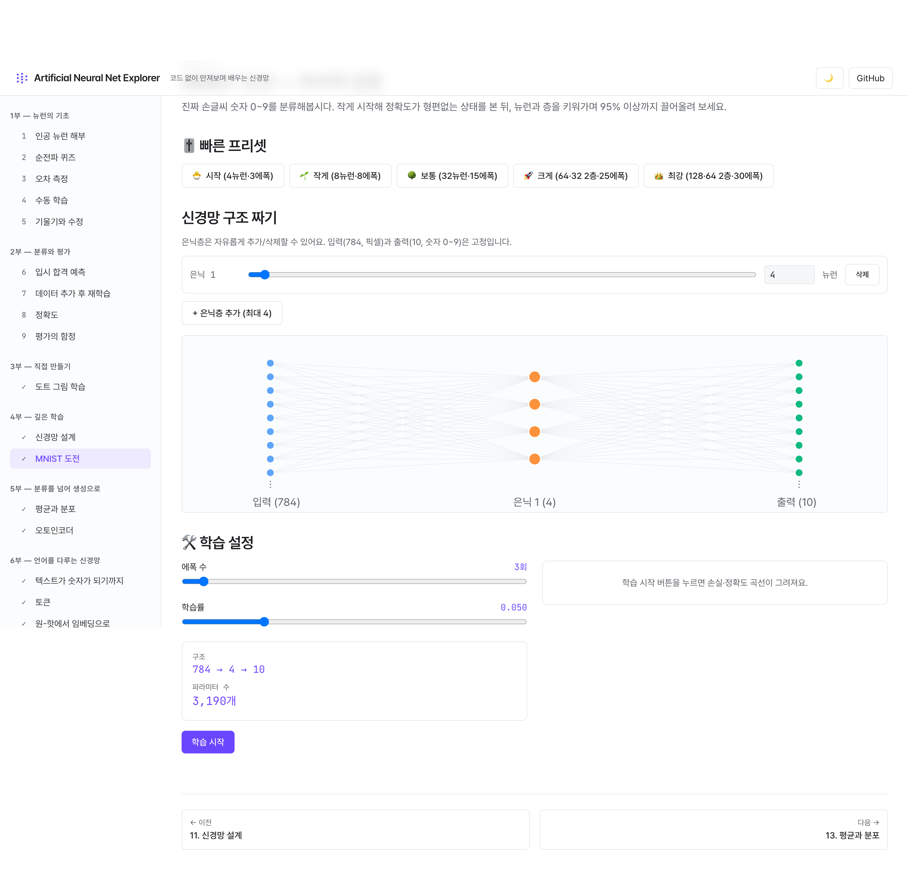

*1차 포털 — 4부를 끝내면 MNIST 페이지 하단에 균열이 열립니다.*

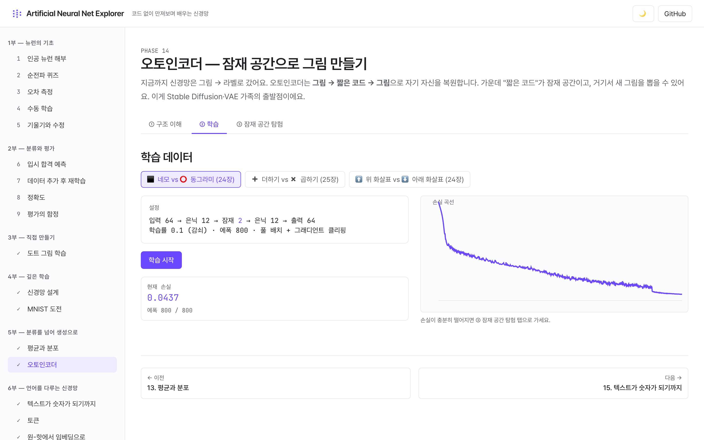

*2차 포털 — 5부를 끝내면 오토인코더 페이지 하단에 책의 균열이 나타납니다.*

> 두 포털 모두 **"지금은 패스"** 옵션이 있습니다. 들어가지 않아도 본 학습은 끝난 거라고 안내해 두면 학생 부담이 줄어요.

---

### C-1 5부 — 분류를 넘어 생성으로

#### 페이즈 13. 평균과 분포 — 가장 단순한 생성 모델

**학습 목표**: 같은 라벨 그림의 픽셀을 평균내면 "평균적인 모양"이 나오고, 그게 가장 단순한 생성 모델임을 체감.

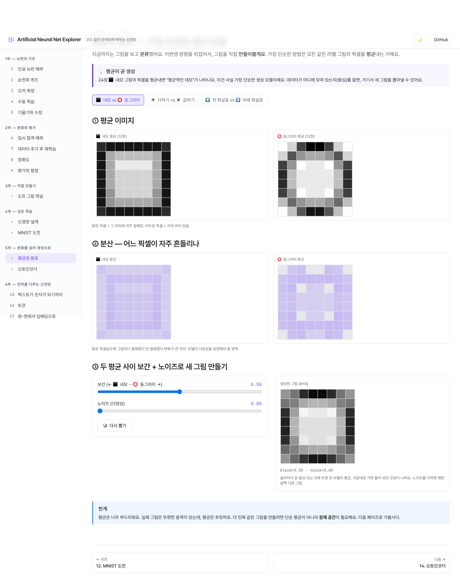

**해보세요**
1. 데이터셋 버튼(네모/원, 동물/탈것 등)을 바꿔가며 두 라벨의 평균 이미지가 어떻게 다른지 비교.
2. **혼합 슬라이더(blend)** 를 0 ↔ 1로 옮기며 두 평균이 어떻게 섞이는지 관찰.
3. **노이즈 슬라이더(noise)** 를 올려 똑같은 평균에서 시드별로 다른 그림이 나오는 걸 확인.

**짚어줄 점** — 분산 패널에서 색이 진한 픽셀일수록 "그림마다 자주 바뀌는 자리"라는 뜻. 분산이 큰 자리에 노이즈를 더 주면 더 그럴듯한 새 그림이 나옵니다.

---

#### 페이즈 14. 오토인코더 — 잠재 공간으로 그림 만들기

**학습 목표**: 그림 → 짧은 코드(잠재 벡터) → 그림 으로 자기 자신을 복원하는 신경망 두 개를 학습. 디코더가 곧 "코드 → 그림" 마법 함수가 됨.

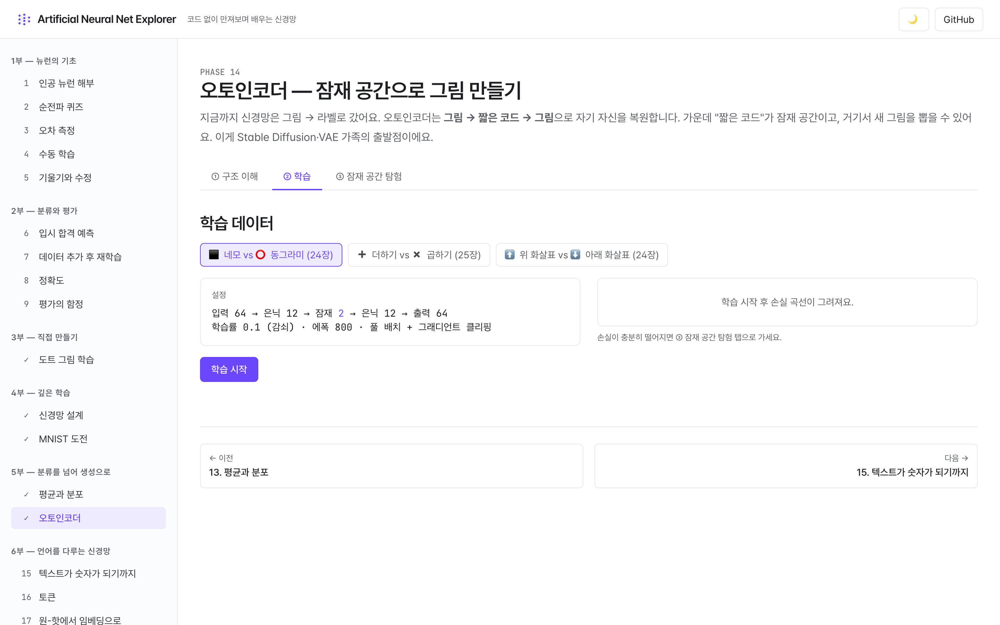

*② 학습 탭 — 학습 시작을 눌러 인코더·디코더 가중치를 동시에 학습합니다.*

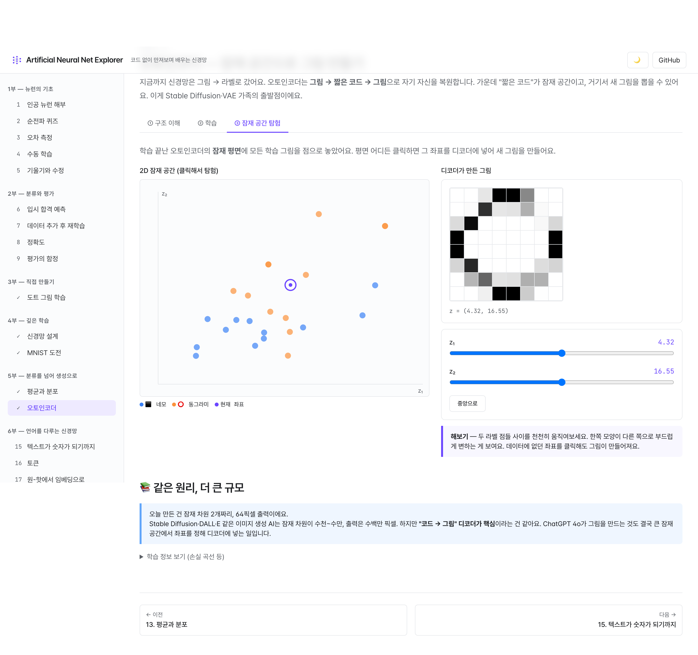

*③ 잠재 공간 탐험 — 잠재 코드(z₁, z₂) 슬라이더를 옮기면 디코더가 새 그림을 그려 줍니다.*

**해보세요**
1. ① 구조 이해 탭에서 64픽셀 → 12 은닉 → **2차원 잠재 코드** → 12 은닉 → 64픽셀 흐름 확인.
2. ② 학습 탭에서 **학습 시작** 버튼. 손실이 내려가는 걸 확인.
3. ③ 잠재 공간 탐험에서 z₁·z₂ 슬라이더를 직접 만져 새 그림을 만들어 보기.
4. (도전) 학습 데이터에 없던 자리에 z를 두면 어떤 모양이 나오는지 살펴보기.

**짚어줄 점** — 잠재 공간의 한 점 = 한 그림이라는 직관. 이게 Stable Diffusion · VAE · DALL·E의 출발점입니다.

> 💡 **여기서 2차 포털이 열립니다.** 페이지 맨 아래의 "책의 균열"을 통과하면 6부로 진입.

---

### C-2 6부 — 언어를 다루는 신경망

5부까지는 모델이 "그림"을 다뤘다면, 6부는 모델이 "말과 글"을 다루는 차원입니다.
글자 → 토큰 → 임베딩 → 시퀀스 → 어텐션 → 트랜스포머 → GPT 다음 토큰 까지 한 단계씩 따라갑니다.

#### 페이즈 15. 텍스트가 숫자가 되기까지

**학습 목표**: 모든 글자는 결국 숫자(코드포인트)로 바뀌고, UTF-8로 1~4 바이트 묶음이 됨을 체감.

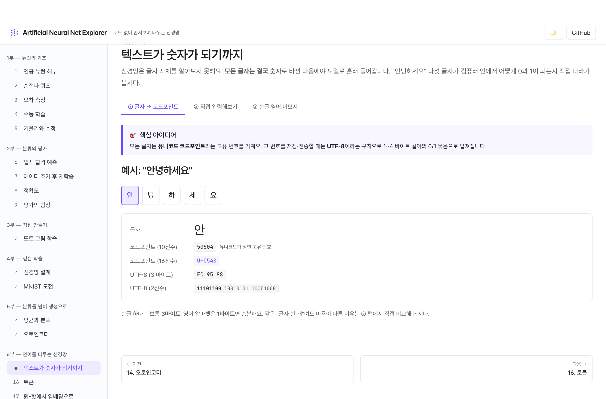

*① 글자 → 코드포인트 — 글자 클릭만으로 10진/16진/UTF-8 바이트/2진수가 펼쳐집니다.*

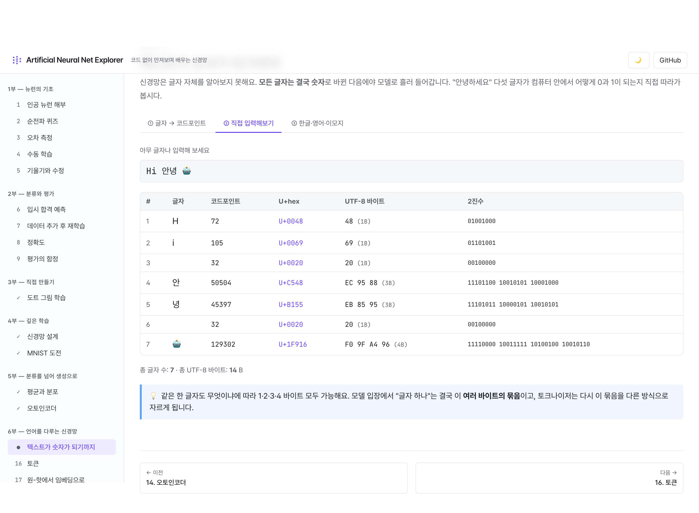

*② 직접 입력 — 자신이 친 텍스트의 글자별 표가 즉시 채워집니다.*

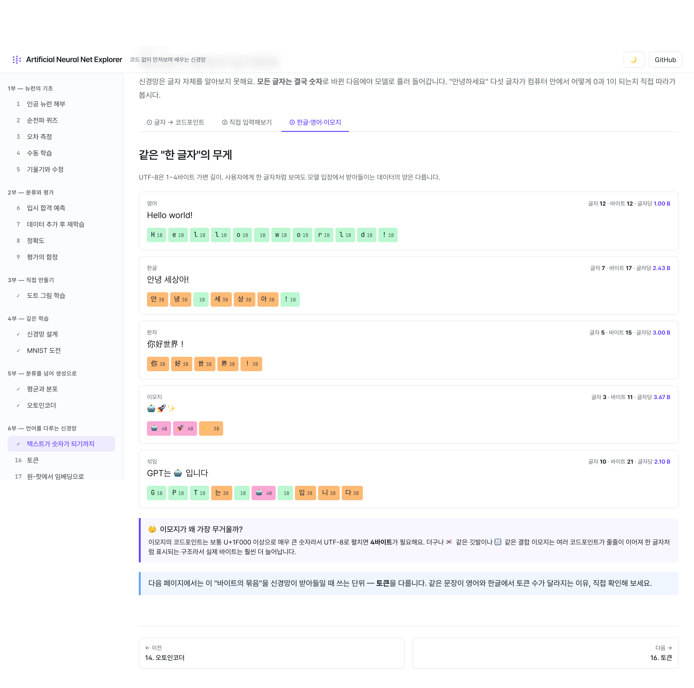

*③ 비교 — 영/한/한자/이모지의 글자당 바이트가 1.00 → 3.67 까지 점점 커집니다.*

**해보세요**
1. ② 탭 입력란에 본인 이름을 한글·영어·로마자로 모두 쳐 넣고 표를 비교.
2. 🚀, 🤖 같은 이모지를 넣고 한 글자가 **4 바이트**임을 확인.
3. ③ 탭에서 "GPT는 🤖 입니다" 같은 섞인 문장의 글자당 바이트가 영어·한글·이모지 사이 어디쯤인지 살펴보기.

---

#### 페이즈 16. 토큰 — 단어보다 작고, 글자보다 큰 조각

**학습 목표**: 모델은 글자도 단어도 아닌 "토큰" 단위로 입력을 받음. BPE 규칙으로 어떻게 토큰이 만들어지는지 직관 잡기.

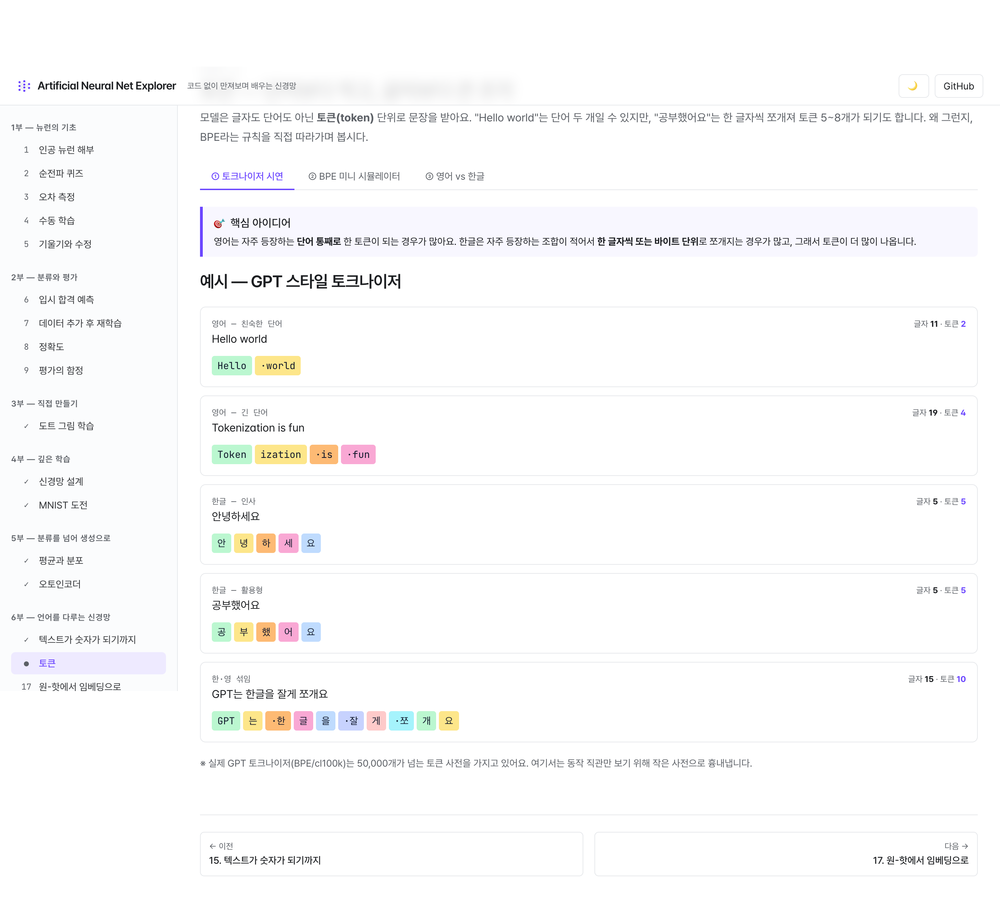

*① GPT 스타일 토크나이저 시연 — 같은 문장이 영어·한글에서 다르게 잘립니다.*

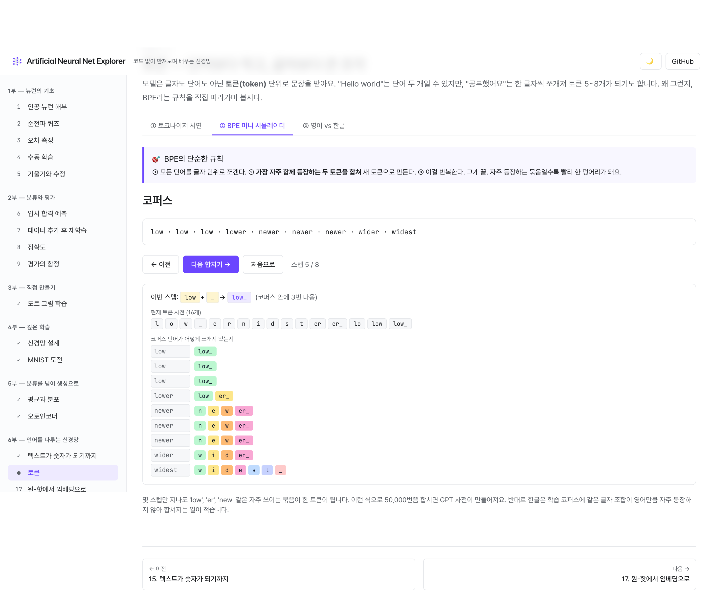

*② BPE 미니 시뮬레이터 — 단계별 합치기 과정을 한 클릭씩 진행.*

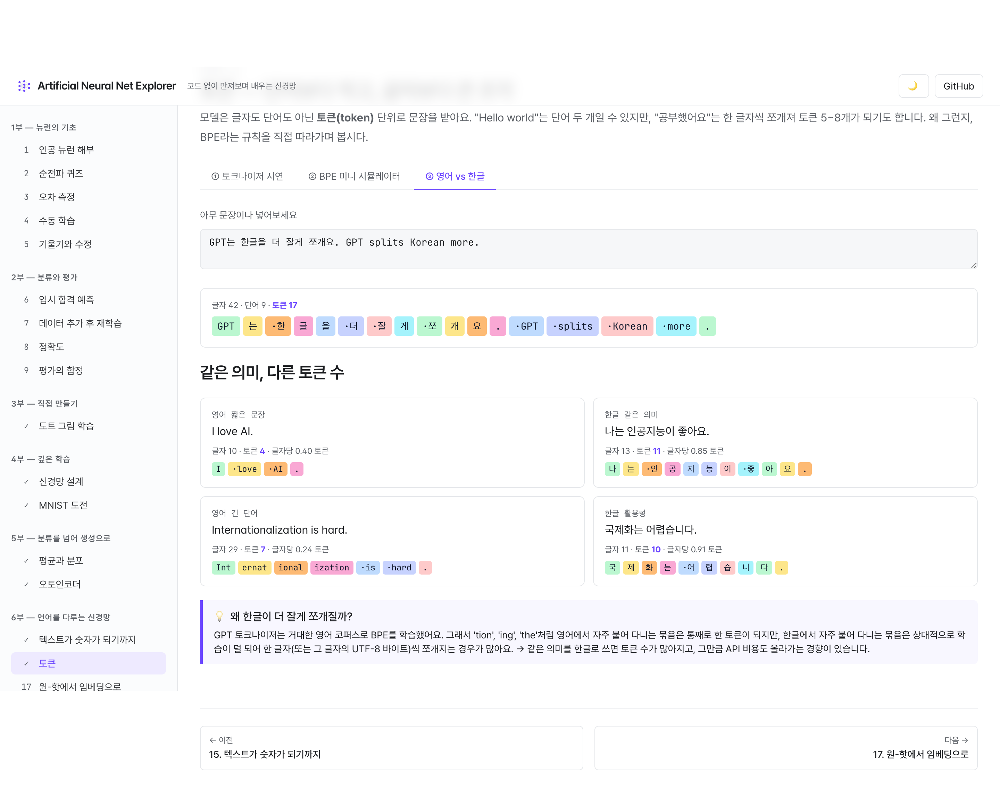

*③ 영어 vs 한글 — 같은 의미라도 한글은 토큰 수가 훨씬 많아집니다.*

**해보세요**
1. ② 탭에서 **다음 합치기** 버튼을 한 번씩 누르며 'low_', 'er_', 'low'가 차례로 한 토큰이 되는 걸 관찰.
2. 한 행의 단어가 어떻게 압축되는지 색칠된 토큰 칩으로 확인.
3. ③ 탭에서 같은 의미의 영어/한글 문장의 **글자당 토큰 수**를 비교 (보통 한글이 2배 이상).

**짚어줄 점** — 한글이 더 잘게 쪼개지는 건 GPT 사전이 영어 코퍼스로 학습됐기 때문이라는 점. API 비용이 한글에서 더 비싸지는 실제 이유입니다.

---

#### 페이즈 17. 원-핫 → 임베딩, 단어가 벡터가 되는 이유

**학습 목표**: 원-핫의 한계(고차원 + 모든 쌍 cos = 0) → 학습되는 임베딩 벡터로 의미를 위치에 새기는 발상.

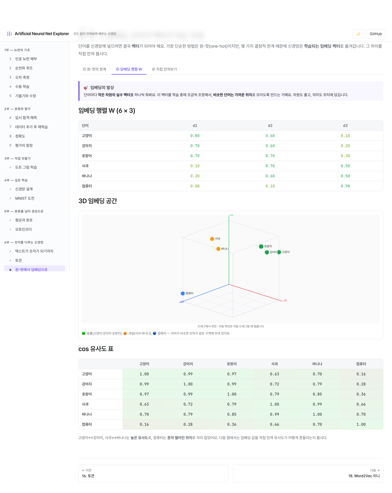

*② 임베딩 행렬 W — 6개 단어 × 3차원 행렬과 회전 가능한 3D 산포도.*

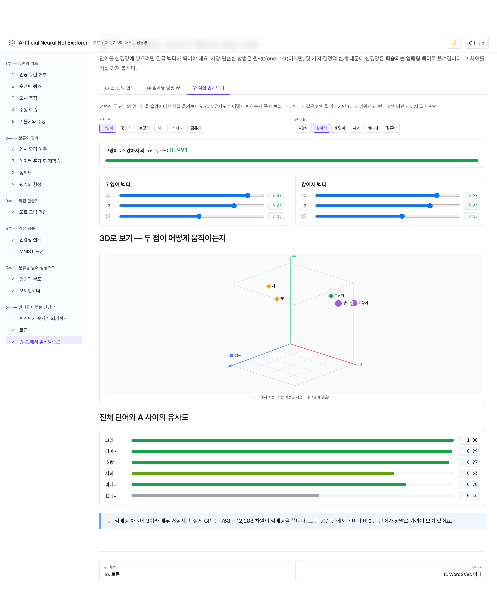

*③ 직접 만져보기 — 두 단어 벡터를 슬라이더로 옮기면 cos 유사도가 즉시 변합니다.*

**해보세요**
1. ② 탭의 3D 그래프를 **드래그**해서 동물 / 과일 / 컴퓨터 클러스터 위치 확인. (자동 회전 중이면 첫 드래그에 멈춤)
2. ③ 탭에서 "고양이"와 "강아지"를 골라 슬라이더로 한 단어를 멀리 보냈을 때 cos가 1 → -1까지 변하는 걸 관찰.
3. 막대 차트에서 단어 A 기준으로 다른 모든 단어와의 유사도가 함께 변하는 걸 확인.

---

#### 페이즈 18. Word2Vec 미니 — 브라우저에서 직접 학습

**학습 목표**: skip-gram 알고리즘으로 임베딩이 "자동으로" 자리잡는 과정을 직접 학습 + 벡터 산수의 의미.

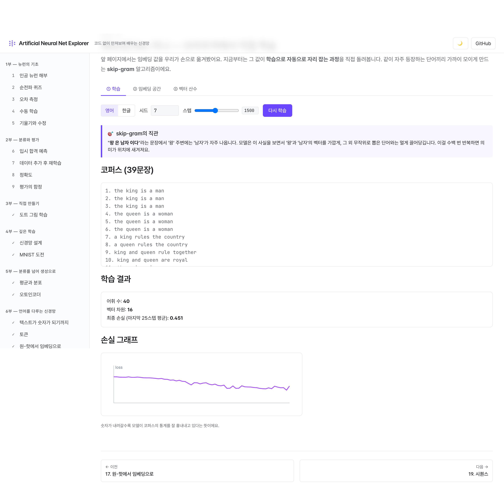

*① 학습 — 학습 시작을 누르면 손실이 내려가는 그래프를 볼 수 있습니다.*

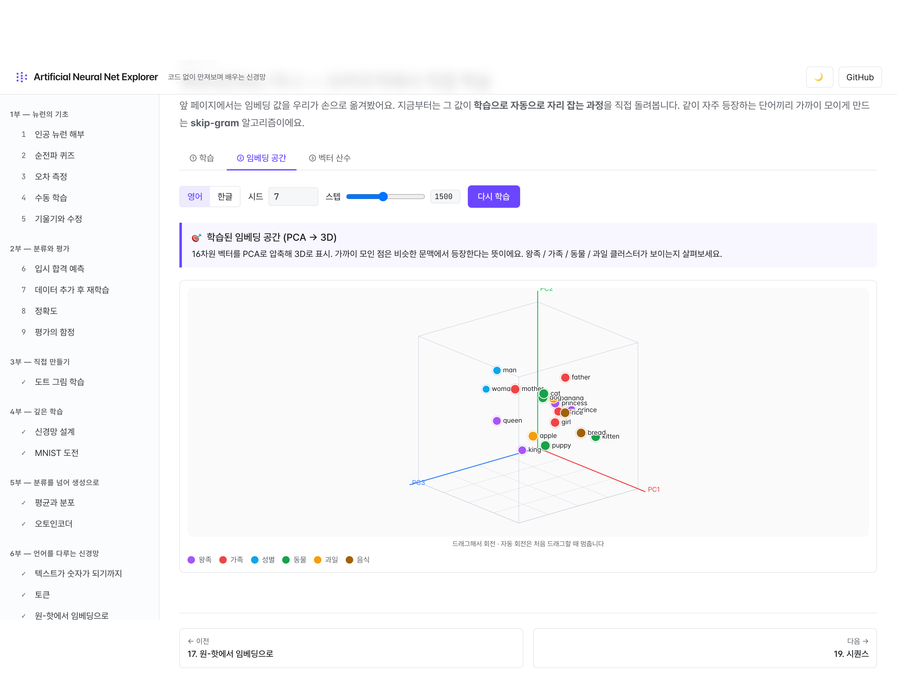

*② 임베딩 공간 — 학습된 16차원 벡터를 PCA로 3D 투영. 왕족·가족·동물·과일 클러스터가 보입니다.*

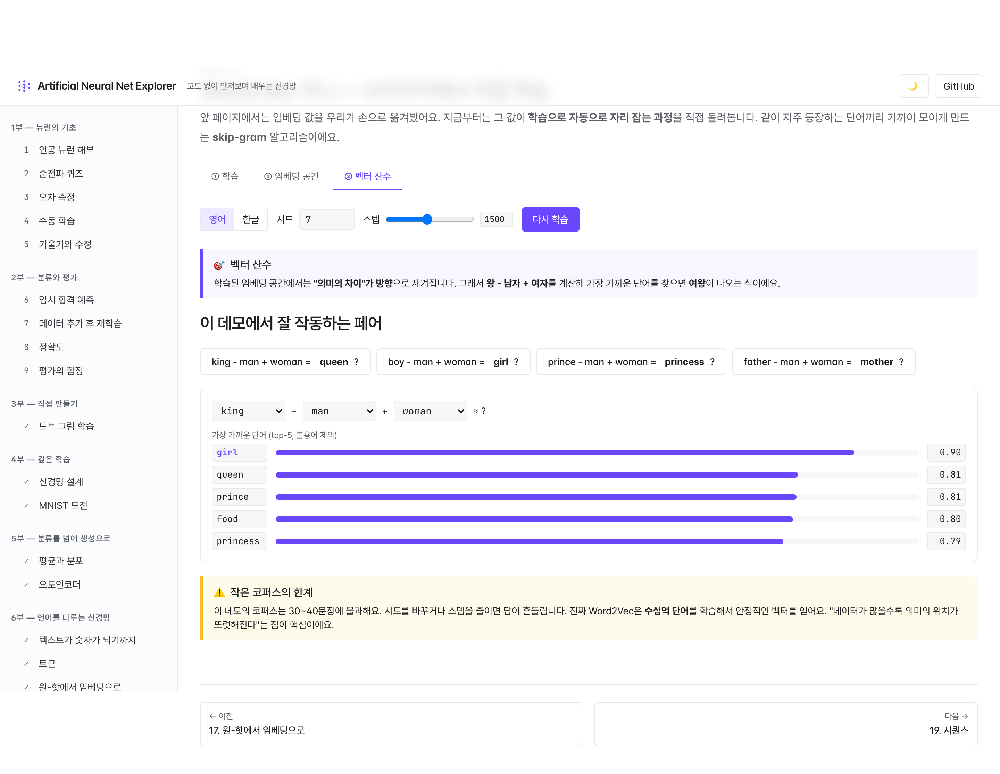

*③ 벡터 산수 — 검증된 페어 한 번 클릭으로 "왕 - 남자 + 여자 ≈ ?" 결과를 볼 수 있습니다.*

**해보세요**
1. 영어 / 한글 토글 + 시드(EN=7, KO=100 권장) + 스텝(1500~2000) 으로 **학습 시작**.
2. ② 탭에서 클러스터 회전. 왕족(보라), 동물(녹색), 과일(주황)이 서로 떨어진 자리에 모이는지 확인.
3. ③ 탭의 검증 페어 버튼 클릭:
   - **boy - man + woman ≈ girl** (top-1)
   - **king - man + woman ≈ queen** (top-2~3)
   - **왕 - 남자 + 여자 ≈ 여왕** (top-1)
4. 자유 입력으로 다른 페어를 시도해 **흔들리는 결과**도 함께 보기.

**짚어줄 점** — 안정적인 결과를 위해 진짜 Word2Vec은 수십억 단어를 학습합니다. "데이터가 많을수록 의미의 위치가 또렷해진다."

---

#### 페이즈 19. 시퀀스 — 순서가 의미를 만드는 순간

**학습 목표**: 단어 가방 / 평균 임베딩의 한계 → RNN이 순서를 어떻게 보존하는지 직관.

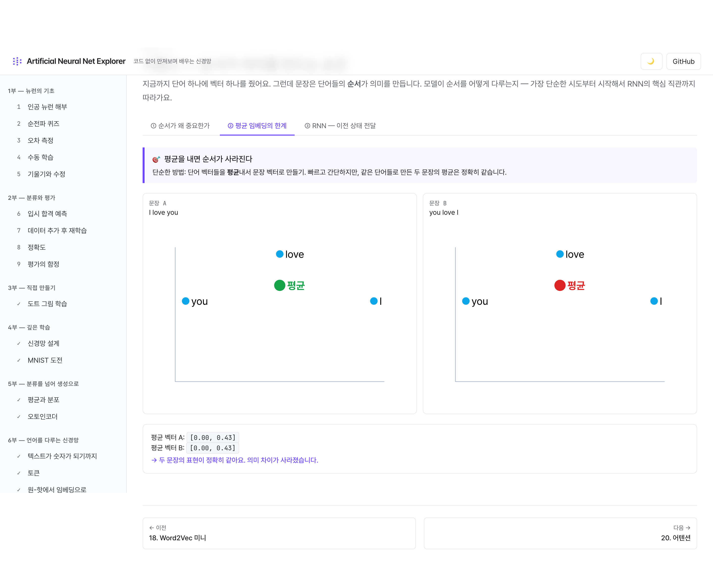

*② 평균 임베딩의 한계 — "I love you"와 "you love I"의 평균 벡터가 정확히 같습니다.*

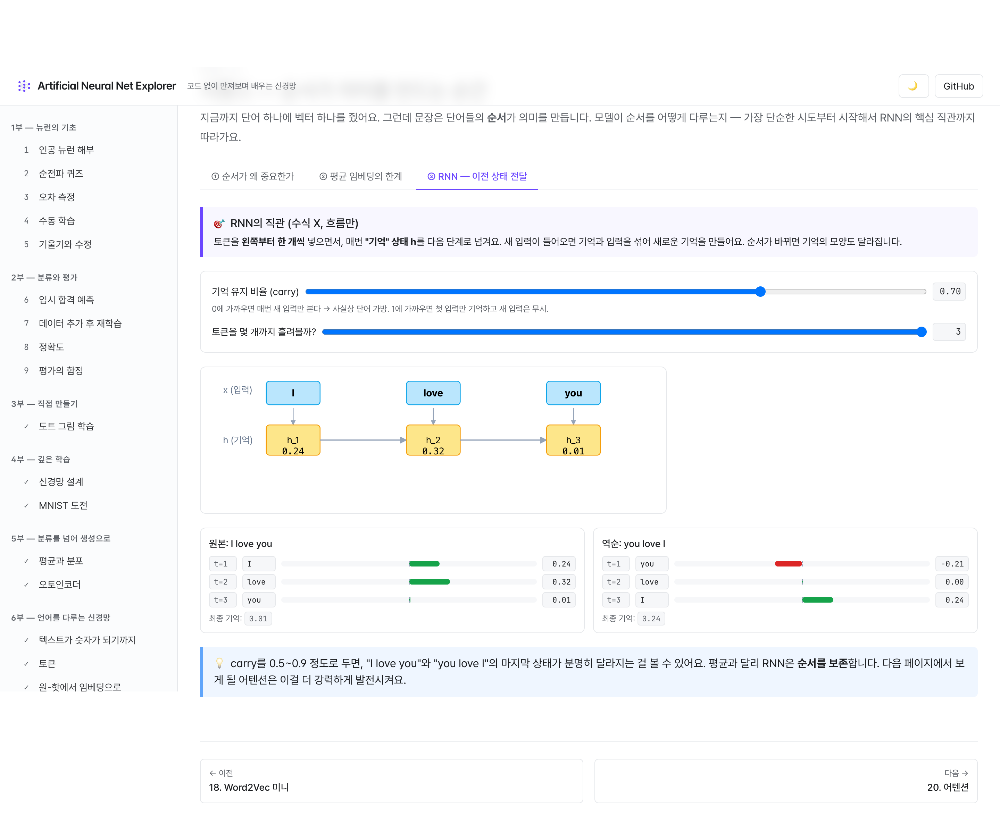

*③ RNN — carry 슬라이더로 이전 상태를 얼마나 유지할지 직접 조절.*

**해보세요**
1. ① 탭에서 "Dog bites man" vs "Man bites dog" 같은 페어를 보며 순서가 의미를 어떻게 뒤집는지 토론.
2. ③ 탭의 carry 슬라이더를 0 → 0.5 → 0.9 로 변경하며 두 문장의 **최종 기억** 값이 어떻게 갈라지는지 확인.
   - carry=0 : 마지막 입력만 기억 (정/역 순서 차이 큼)
   - carry=0.9 : 첫 입력만 기억 (새 입력 거의 무시)
3. 셀 내부의 막대 그래프로 t=1, t=2, t=3에서 기억이 어떻게 누적되는지 관찰.

---

#### 페이즈 20. 어텐션 — 어디에 집중할지 정해보기

**학습 목표**: 어텐션은 "단어들끼리 점수 매기기 + softmax로 정규화 + 가중 합"이라는 세 단계임을 손으로 만져보며 이해.

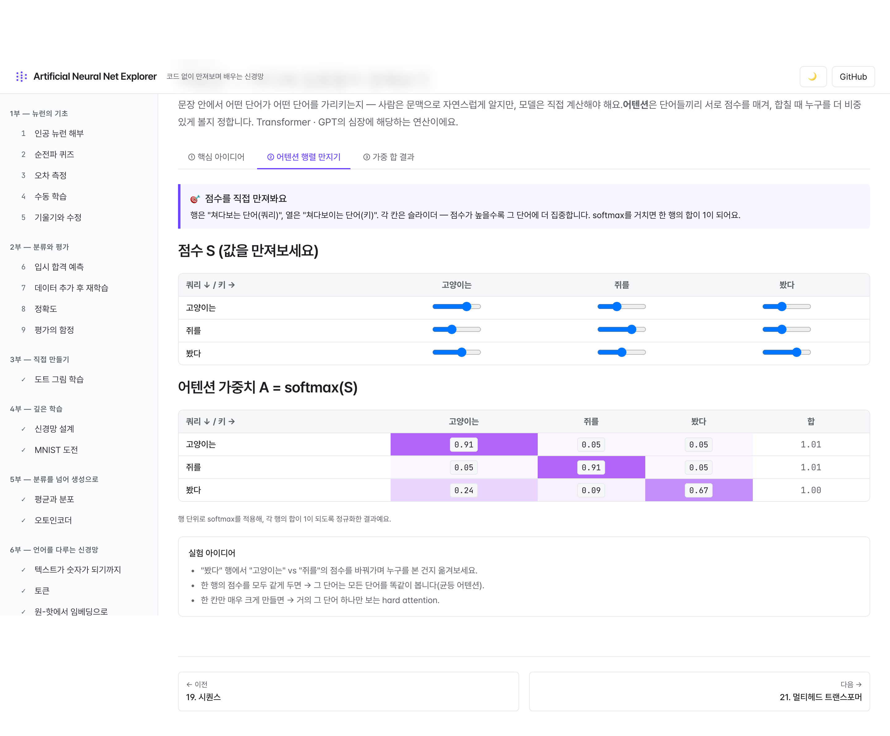

*② 어텐션 행렬 만지기 — 각 칸의 슬라이더로 점수를 직접 조정.*

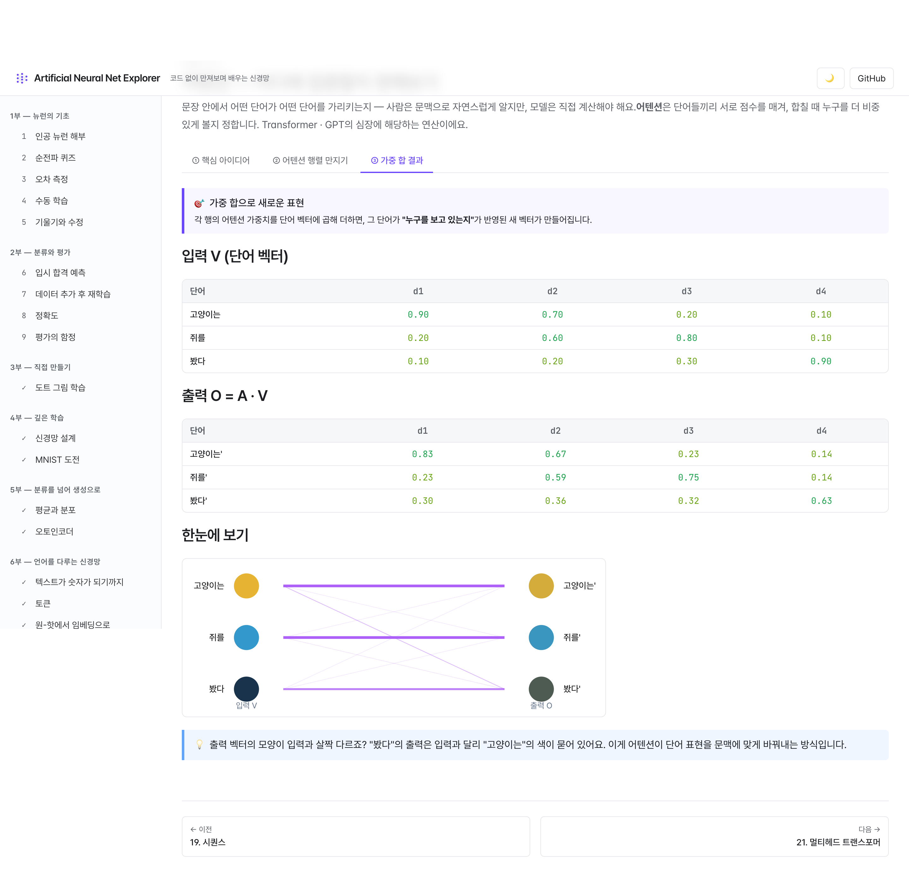

*③ 가중 합 결과 — 어텐션 가중치로 단어 벡터를 합쳐 새로운 문맥 표현을 만듭니다.*

**해보세요**
1. ② 탭에서 "봤다" 행의 점수를 만져 "고양이는" vs "쥐를" 중 누구를 보는지 옮겨보기.
2. softmax 가중치 표에서 **각 행의 합이 1**인 걸 확인 (반올림으로 1.01도 가능).
3. ③ 탭의 다이어그램에서 입력 → 출력 화살표 굵기가 가중치라는 걸 관찰. "봤다'"의 출력이 "고양이는" 색으로 살짝 물든 걸 확인.

**짚어줄 점** — 실제 식 `softmax(QKᵀ/√d)V`을 Q=K=V로 단순화한 시뮬레이션이지만, 본질은 동일.

---

#### 페이즈 21. 멀티헤드 트랜스포머 — 여러 시선과 한 블록의 흐름

**학습 목표**: 한 어텐션은 한 시선밖에 못 봄 → 여러 헤드 + 한 블록(LayerNorm → Attn → 잔차 → LayerNorm → FFN → 잔차) → 깊이 쌓기.

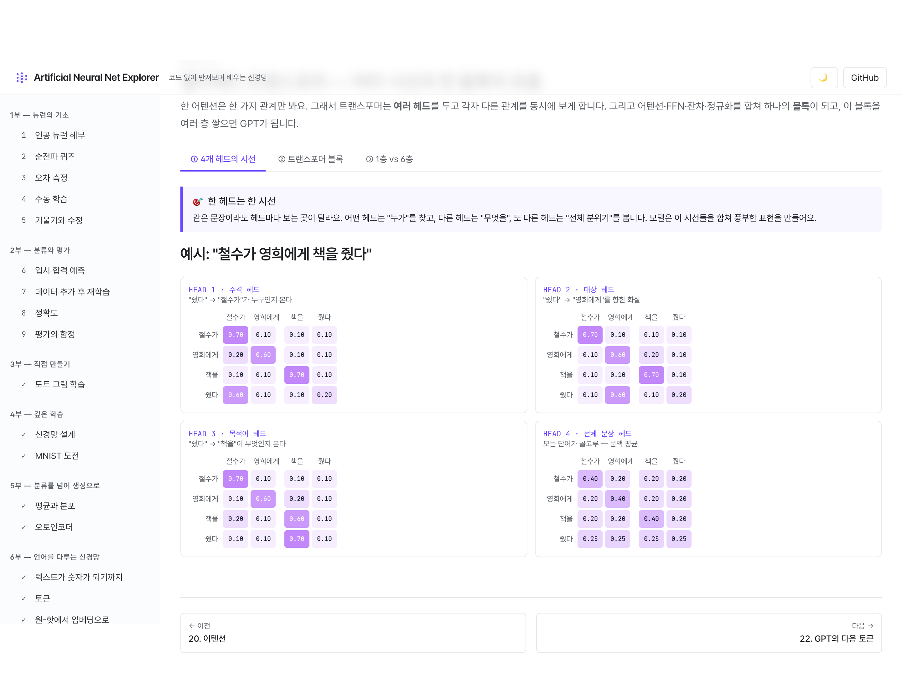

*① 4개 헤드의 시선 — "철수가 영희에게 책을 줬다"를 주격/대상/목적어/전체 헤드가 다르게 봅니다.*

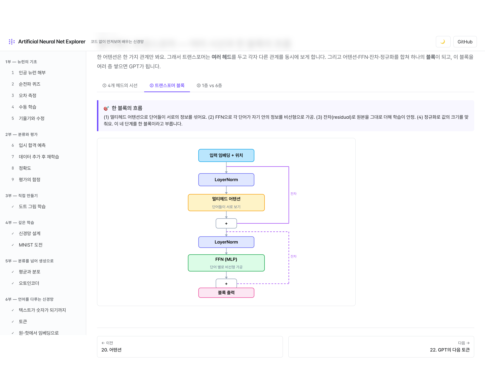

*② 트랜스포머 블록 — 한 블록의 데이터 흐름과 두 개의 잔차 연결.*

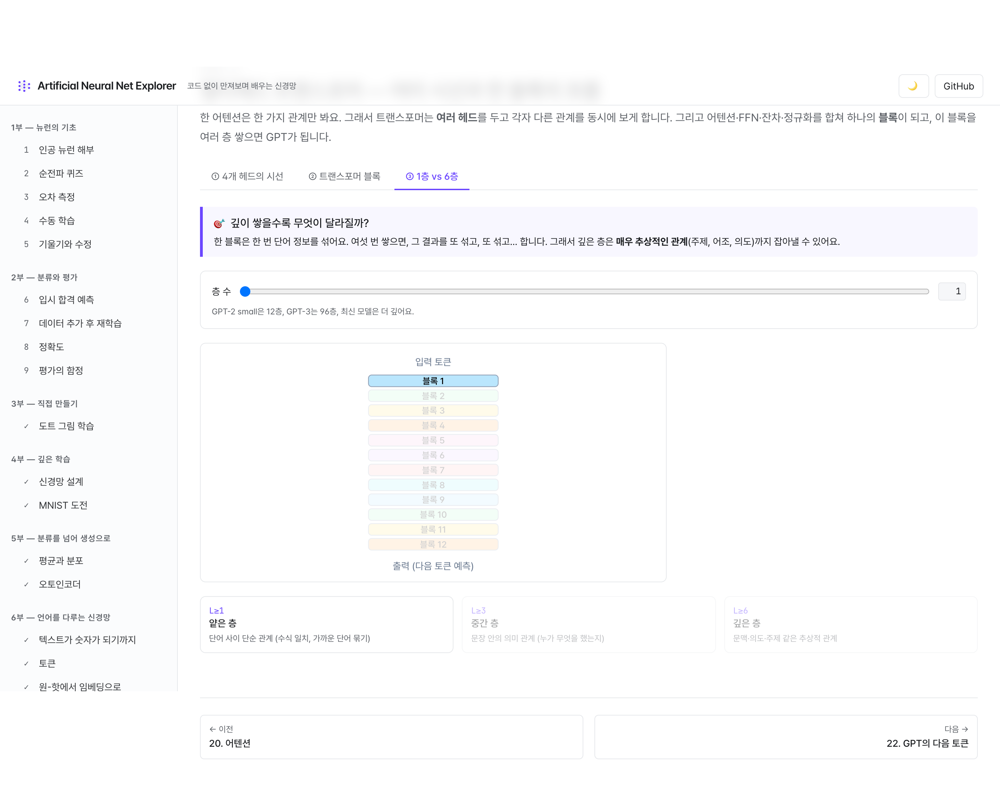

*③ 1층 vs 6층 — 슬라이더로 층 수를 늘리면 깊은 층이 추상적 관계까지 잡습니다.*

**해보세요**
1. ① 탭에서 4개 헤드 중 **어떤 헤드가 어떤 관계**를 보는지 짝과 맞춰 보기.
2. ② 탭의 블록 다이어그램을 따라가며 잔차 연결이 왜 두 군데에 있는지 토론.
3. ③ 탭의 층 슬라이더를 1 → 12로 옮기며 GPT-2(12층), GPT-3(96층) 정도의 규모를 가늠.

---

#### 페이즈 22. GPT의 다음 토큰 — 샘플링이 곧 창의성

**학습 목표**: GPT가 한 토큰씩 만드는 방식 — logit → softmax 분포 → temperature/top-k/top-p로 샘플링.

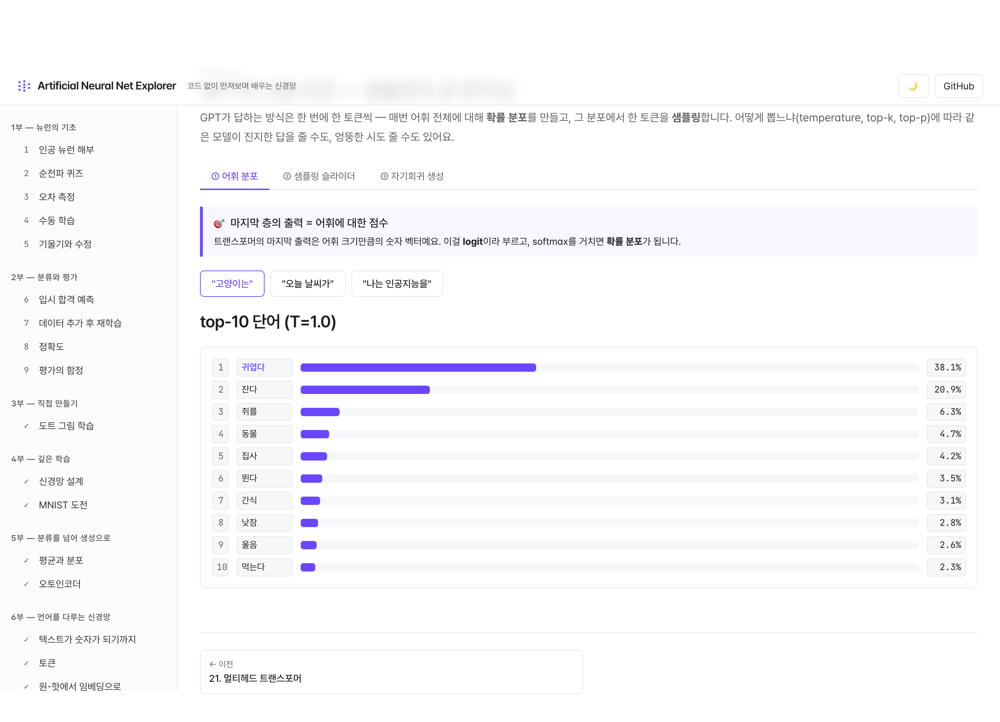

*① 어휘 분포 — 짧은 문맥 다음에 올 토큰의 top-10 확률.*

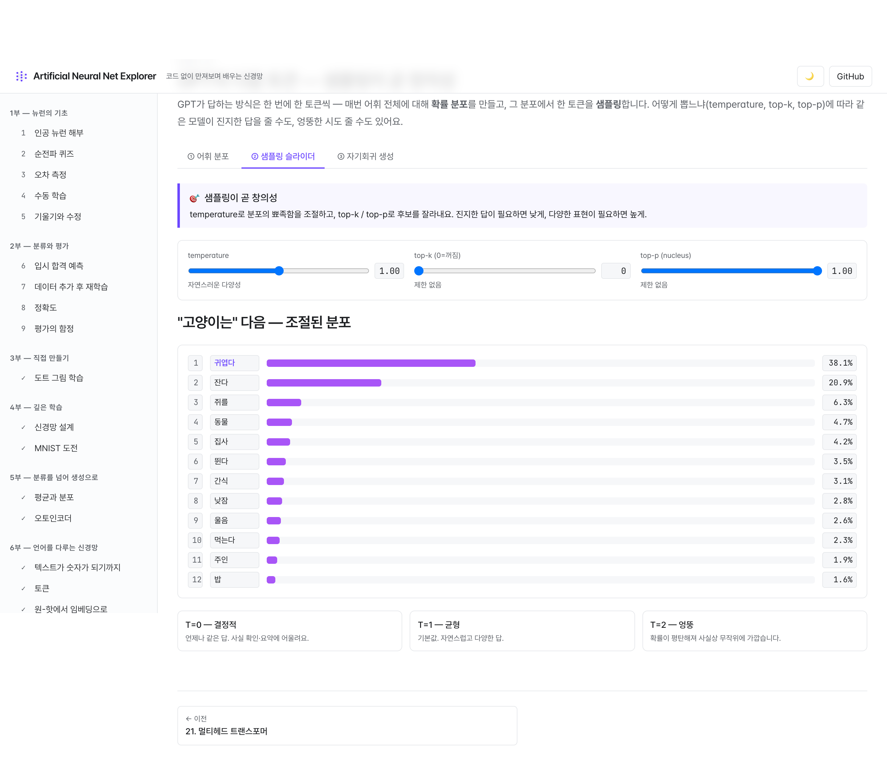

*② 샘플링 슬라이더 — temperature/top-k/top-p가 분포를 어떻게 깎고 평탄화하는지.*

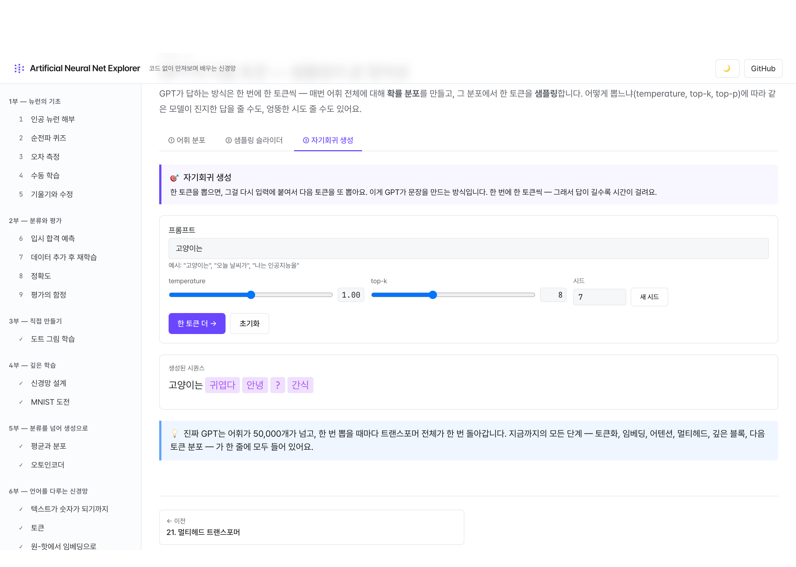

*③ 자기회귀 생성 — 한 토큰씩 누적해 시퀀스를 늘려 갑니다.*

**해보세요**
1. ② 탭에서 **temperature** 를 0.1 → 1 → 2 로 옮기며 top-1 확률이 99.8% → 38% → 17% 로 변하는 걸 확인.
2. **top-k** 를 5 정도로 줄여서 후보가 줄어드는 걸 관찰.
3. ③ 탭에서 프롬프트("고양이는", "오늘 날씨가" 등)를 골라 **한 토큰 더** 버튼을 여러 번. 같은 시드면 결과가 동일, 새 시드를 누르면 달라지는 걸 확인.
4. T를 매우 낮게/높게 두고 결과의 차이를 직접 비교.

**마무리 멘트(권장)**
> "지금까지 본 모든 단계 — 토큰화, 임베딩, 어텐션, 멀티헤드, 깊은 블록, 다음 토큰 분포 — 가
> ChatGPT가 한 줄을 답할 때 한 토큰마다 한 번씩 통째로 돌아갑니다."

---

### C-3 5부·6부 운영 팁

- **두 포털 모두 "지금은 패스" 옵션이 있습니다.** 들어가지 않아도 본 학습은 끝난 거라고 안내해 두면 학생 부담이 줄어요.
- **6부는 50분 한 차시로는 빠듯합니다.** 시간이 부족하면 p15·p16·p18·p20·p22 다섯 페이즈만 깊게 다루고, p17/p19/p21은 발문 위주로 빠르게 흐르세요.
- **3D 회전 데모**(p17, p18)는 자동 회전이 학생 시선을 끌기 좋아요. 처음 몇 초 그대로 두고 멘트 후 직접 드래그해 보게 하세요.
- **Word2Vec(p18) 학습은 시드에 민감**합니다. 기본값(EN=7, KO=100)이 잘 작동하는 페어로 검증돼 있으니, 학생에게는 "시드 = 출발점이 다른 학습"이라고 설명하고 그대로 시연하는 게 안전합니다.
- **자기회귀 생성(p22)** 은 컨텍스트 사전이 작아서 4~5토큰을 넘기면 무작위에 가까워져요. "프롬프트가 길어질수록 진짜 GPT는 더 정교해진다" 정도로 마무리.

---

### C-4 화면 캡처 다시 만들기

UI가 바뀌면 다음 명령으로 모든 캡처를 재생성합니다.

```bash
# 미리보기 서버가 :4035에 떠 있어야 합니다
node scripts/capture-walkthrough.mjs
```

`docs/screenshots/` 안에 26장이 자동으로 갱신됩니다.

---

## 마치며

**Artificial Neural Net Explorer**는 코드 없이도 신경망의 본질을 손끝으로 가르칠 수 있는 도구입니다.
이 가이드를 그대로 따라가도 되고, 학교 상황에 맞게 차시 분배를 조정해도 됩니다.

수업이 끝났을 때 학생이 "AI는 마법이 아니다, 곱셈과 덧셈의 거대한 조합이다, 그리고 나도 만들 수 있다"라고 느낀다면 충분합니다.

> **이 수업의 가장 큰 목표**: AI 시대를 살아갈 학생이 AI를 신비로워하거나 두려워하지 않고, **이해하고 만들 수 있는 도구**로 인식하는 것.

문의·개선 제안: https://github.com/greatsong/neural-explorer/issues

— 수업 가이드 v1.0 (2026)
